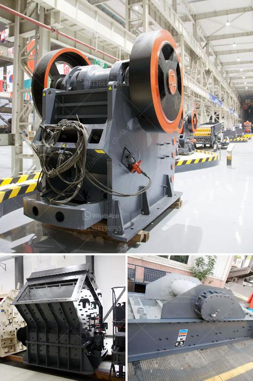

<h3>stone crusher machine price in philippines</h3>
The price of a stone crusher machine in the Philippines has been a concern for many customers. The stone crusher machine is not expensive, but it is also not low-priced. After all, the investment in this equipment is more valuable than ordinary small equipment. Such as small metal shredder, mobile vertical-plate crusher, hammer crusher and rotor-crushing machine. These stone crusher machines have different prices due to their specific models, specifications, and capacities. To help you buy the right equipment for your construction project, here are some tips before you make your purchase.

First, determine the requirements of the project. By doing this, you can consider whether you need a stationary or mobile stone crusher machine. A stationary stone crusher machine for construction requires a large investment, while mobile stone crusher plant is more convenient for disposal during a small construction site. Nowadays, mobile crusher has better mobility because of its portability. Therefore, it can save a lot of infrastructure and transportation costs for you.

Second, consider the quality of the equipment. You should buy equipment from professional manufacturers with good reputation. The quality and performance of the machine will directly affect the output of your project. For example, credible manufacturers use high-quality materials in the production of their machines and conduct strict quality control processes. Therefore, their stone crusher machines have excellent performance and long service life. Besides, you can also look for crushers made by well-known international brands such as Metso, Sandvik, and Terex.

Next, consider the capacity of the machine. The different models of stone crusher machines have different capacities. For example, the capacity of an impact crusher is 50-300t/h, while a cone crusher can only handle t/h. The price of the machine will depend on its production capacity. Therefore, when buying a stone crusher machine, you should consider the capacity you need.

Lastly, consider your budget. The price range of stone crusher machines is quite high due to the different types, sizes, and models. Therefore, it is essential to determine your budget before you start your search. Depending on your budget, you can find a stone crusher machine that fits your specific needs and requirements.

In conclusion, the price of a stone crusher machine in the Philippines is affected by various factors, such as the equipment's capacity, quality, brand, and location of purchase. If you want to buy a high-quality machine, please try to choose a reliable manufacturer from the global market. Ensure to check the machine's performance and functions before making the final decision. By doing so, you can get the most suitable stone crusher machine at a reasonable price for your construction project in the Philippines.
<h3>Contact us</h3><ul><li><strong>Whatsapp:&nbsp;<a href="https://wa.me/8613661969651">+8613661969651</a></strong></li><li><a href="https://swt.shibang-china.com/?git&amp;zhl&amp;stone crusher machine price in philippines"><strong>Online Service(chat now)</strong></a></li></ul><h3>Related</h3><ul><li><a href='mining crusher equipment south africa.md'>mining crusher equipment south africa</a></li><li><a href='limestone micronizer machine limestone micronizer mill.md'>limestone micronizer machine limestone micronizer mill</a></li><li><a href='sell mill of hammers malaysia.md'>sell mill of hammers malaysia</a></li><li><a href='coal mining process machinery.md'>coal mining process machinery</a></li><li><a href='malaysia grinder hammer mill manufacturer.md'>malaysia grinder hammer mill manufacturer</a></li></ul>