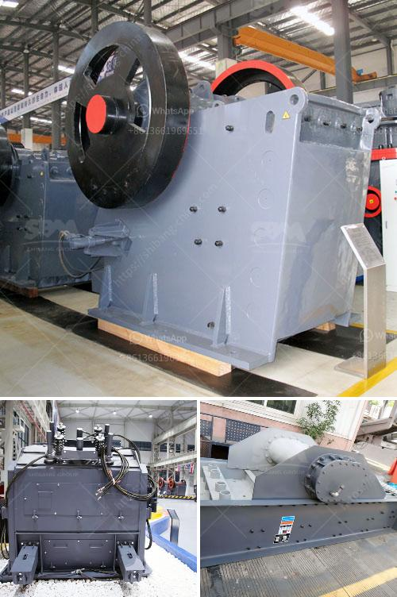

<h3>stone crusher manufactured in new zealand</h3>
Stone crusher machines are commonly used to process raw materials, especially minerals, to produce aggregate or gravel for construction purposes. These machines are usually found in quarries, utilizing enormous stones as the input material. The significance of stone crushers in the construction industry cannot be underestimated, as they play a vital role in ensuring that stones are crushed to desirable sizes for various uses.

In New Zealand, there are numerous manufacturers and suppliers of stone crushers, which range from large-scale industrial units to small and medium-sized ones. The granite crusher machines that are employed in New Zealand vary in their capabilities and are suitable for crushing rocks and stones of various hardness levels. The robustness and durability of these machines enable them to be used for a wide range of purposes, including metals refining and soil shredding.

The stone crushers manufactured in New Zealand comply with rigorous quality standards, ensuring that they are durable and to withstand the harsh environments they are typically used in. Designed with the latest technology, these crushers are highly efficient and offer a high crushing capacity. Their automated features ease the operation process, allowing for less labor-intensive work and minimizing human errors. The user-friendly interface and simple maintenance requirements make these stone crushers popular among users in the construction industry.

The stone crusher machines manufactured in New Zealand come with a unique combination of heavy-duty construction, flexibility, and efficiency. The availability of different machine sizes and types makes it convenient for businesses and homeowners to find the right equipment that suits their needs. Whether you're crushing rocks for building materials or extraction purposes, these machines are designed to deliver optimal performance and ensure high productivity.

In conclusion, stone crushers manufactured in New Zealand are capable of fulfilling a variety of crushing needs, producing material for various uses like concrete, drainage, metal dust, sub-base, and more. The stone crushers are sold directly by several manufacturers, thus eliminating the middleman and reducing the cost of transportation. They are also environmentally friendly machines that minimize waste and pollution. With their exceptional crushing capabilities, these stone crushers are contributing to the growth and development of the construction industry in New Zealand.
<h3>Contact us</h3><ul><li><strong>Whatsapp:&nbsp;<a href="https://wa.me/8613661969651">+8613661969651</a></strong></li><li><a href="https://swt.shibang-china.com/?git&amp;zhl&amp;stone crusher manufactured in new zealand"><strong>Online Service(chat now)</strong></a></li></ul><h3>Related</h3><ul><li><a href='vertical shaft impact crusher from new zealand.md'>vertical shaft impact crusher from new zealand</a></li><li><a href='sand washer for price.md'>sand washer for price</a></li><li><a href='pakistan copper crusher processing comoanies.md'>pakistan copper crusher processing comoanies</a></li><li><a href='magnesite ore mining process.md'>magnesite ore mining process</a></li><li><a href='equipment used in quarry crusher.md'>equipment used in quarry crusher</a></li></ul>