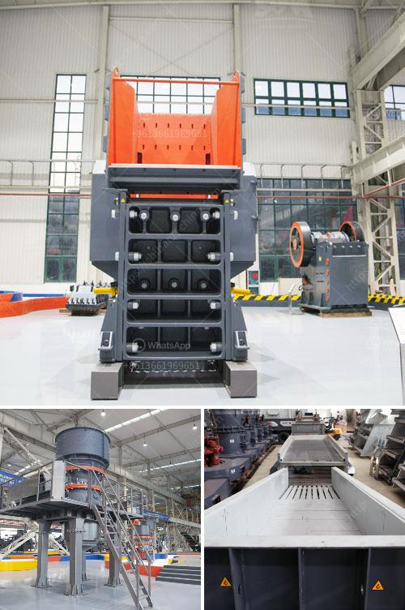

<h3>stone crusher manufacturer turkey</h3>
Stone crusher machines are used for crushing stones in crushing plants. These plants are widely used in mining, metallurgy, construction, petrochemicals, chemistry, building materials, and many other sectors. Stone crusher machines can be used to crush big stones into small ones or even fine sand, making them essential for various industries. There are different types of stone crushers in the market, each with its own set of benefits and features. It is important to select the right stone crusher machine for your project to ensure efficiency and cost-effectiveness.

Turkey is a popular choice for many stone crusher buyers because of its rich mineral resources, rapid urbanization, and infrastructure development. Turkey's construction sector is booming, with a large number of construction projects underway. This creates a great demand for stone crusher machines. To meet this demand, a number of stone crusher manufacturers have focused on improving the quality and performance of their machines.

Turkey is known for its diverse geography and geological formations, with some areas rich in heavy minerals and stone deposits. This has led to the emergence of many stone crusher manufacturers in the country. Turkey's crushing industry is dominated by a few well-established companies that have been in the business for several decades. These companies offer a range of crushers, including jaw crushers, impact crushers, cone crushers, and mobile crushers. They also produce a variety of screening equipment to separate the crushed stones into different sizes.

One of the leading stone crusher manufacturers in Turkey is OMEGA Makina. The company manufactures crushers for a range of applications, including mining, construction, and recycling. OMEGA Makina's crushers are designed to provide high productivity, long service life, and low operating costs. Their machines are known for their robust construction, ease of maintenance, and user-friendly operation.

Another prominent stone crusher manufacturer in Turkey is MADEN Crushing & Screening. They offer a wide range of crushers, including jaw crushers, impact crushers, cone crushers, and vertical shaft impact crushers. MADEN Crushing & Screening also provides a wide array of screening equipment to meet the varying needs of their customers. Their machines are known for their reliability, energy efficiency, and excellent crushing performance.

Stone crusher manufacturers in Turkey are constantly striving to improve their machines, using advanced technologies and innovative designs. They also focus on research and development to introduce new features and improve overall machine performance. This makes Turkey an ideal destination for stone crusher buyers looking for high-quality machines that can handle various types of stones and provide excellent crushing results.

In conclusion, Turkey is a leading destination for stone crusher buyers due to its rich mineral resources, rapid urbanization, and infrastructure development. It is home to several well-established stone crusher manufacturers that offer a range of machines designed for different applications. These manufacturers focus on improving the quality, performance, and efficiency of their machines to meet the growing demand. If you are in the market for a stone crusher, Turkey is a great place to explore the options available and find the right machine for your project.
<h3>Contact us</h3><ul><li><strong>Whatsapp:&nbsp;<a href="https://wa.me/8613661969651">+8613661969651</a></strong></li><li><a href="https://swt.shibang-china.com/?git&amp;zhl&amp;stone crusher manufacturer turkey"><strong>Online Service(chat now)</strong></a></li></ul><h3>Related</h3><ul><li><a href='cement production line 1500 tpd.md'>cement production line 1500 tpd</a></li><li><a href='crawler type mobile crushers.md'>crawler type mobile crushers</a></li><li><a href='crusher in ethiopia.md'>crusher in ethiopia</a></li><li><a href='eagle 1400 crusher for sale.md'>eagle 1400 crusher for sale</a></li><li><a href='granite stone processing plant.md'>granite stone processing plant</a></li></ul>