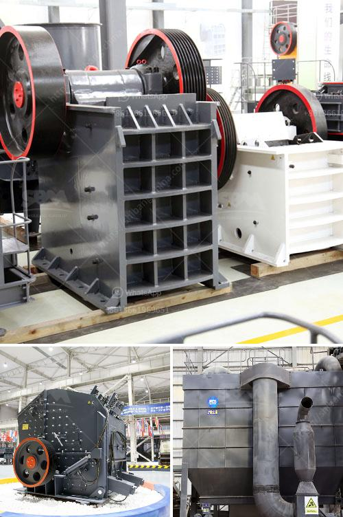

<h3>stone crusher mobile plant south africa</h3>
The demands of the stone crusher mobile plant in South Africa are immense. In mining areas, these mobile stone crushers are widely used in order to effectively deal with obstacles or complex terrain, eliminating the need for stationary crushers. The 300t/h mobile stone crusher plant in South Africa is not limited to the location of crushing operation, and it reduces the cost of material transportation. The mobile crushing plant can also be used as a complete production line.

In recent years, many mobile crushing plants have been exported to South Africa. These plants are highly praised by local customers due to their high efficiency, low cost, and long service life. The mobile crusher plant has a flexible configuration and can be combined with other equipment to form a complete production line.

Nowadays, construction waste is a pressing problem in South Africa. Repurposing waste into useful materials, namely sand and aggregate, has become a profitable industry. Many construction waste materials can be reused for manufacturing new products or construction materials, such as concrete and road base. South Africa has abundant mineral resources, especially in recent years with the infrastructure construction ongoing, mining industry become the focus of investment. We all know that stone crusher plays an important role in the mining industry, so the rapid development of the industry, also contributed to the development of the stone crusher in South Africa.

The used stone crusher in South Africa mainly used in the ore mining beneficiation production lines or stone production line. Making the large stone break into a desired particle size metal smelting or engineering construction, to meet the needs of mineral processing and building products. There are many different types of stone crusher in South Africa, for example, pe jaw crusher, impact crusher,hammer crusher, hp cone crusher, cone crusher, vsi crusher and so on. Among them, the jaw crusher is the most common equipment.

Why does the jaw crusher so popular in South Africain? Jaw crusher is the primary crushing equipment, but also the first choice for primary crushing equipment, but also a highly efficient, energy-saving crushing equipment. The jaw crusher equipment is mainly used for a variety of ores and medium-grained bulk materials crushing, crushing compression strength is not more than 320Mpa available materials. So, no matter what the production line will always use it.

In the recent year, a new generation of jaw crusher has appeared on the market-pew jaw crusher. It is the improved version of the traditional jaw crusher, which adopts modern technology and has a more optimized structure. Compared with the traditional jaw crusher, the pew jaw crusher shows remarkable advantages in terms of strength, reliability, durability and installation. It also has bigger capacity and better performance.

In conclusion, stone crusher mobile plant is a series of stone crusher equipment which is designed to achieve the crushing and screening operation. It can be preferred to choose according to the crushing principle, shape, unique roles. These machines can be designed and produced based on the single or multiple stage crushing needs. Ultimately, it depends on the actual needs of customers.}
<h3>Contact us</h3><ul><li><strong>Whatsapp:&nbsp;<a href="https://wa.me/8613661969651">+8613661969651</a></strong></li><li><a href="https://swt.shibang-china.com/?git&amp;zhl&amp;stone crusher mobile plant south africa"><strong>Online Service(chat now)</strong></a></li></ul><h3>Related</h3><ul><li><a href='primary crusher used in south africa.md'>primary crusher used in south africa</a></li><li><a href='ball mill tons per hour.md'>ball mill tons per hour</a></li><li><a href='produsen mesin ultra fine grinding.md'>produsen mesin ultra fine grinding</a></li><li><a href='used machines from china.md'>used machines from china</a></li><li><a href='small sacle crushers in zambia.md'>small sacle crushers in zambia</a></li></ul>