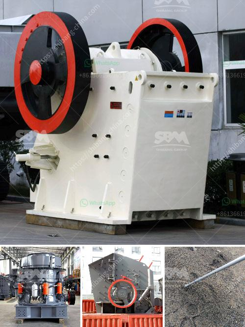

<h3>stone crusher output per hour india</h3>
Stone crushing industry is an important industrial sector in the country engaged in producing crushed stone of various sizes depending upon the requirement which acts as raw material for various construction activities such as construction of roads, highways, bridges, buildings, and canals etc. It is estimated that there are over 12,000 stone crusher units in India. The number is expected to grow further keeping in view the future plans for development of infrastructure of roads, canals and buildings that are required for overall development of the country. In India, the Stone Crushing Industry sector is estimated to have an annual turnover of around Rs. 5000 crore (equivalent to over US$ 1 billion) and is therefore an economically important sector.

Stone crushers are primarily small scale industries mostly owned and operated by less educated individuals and are scattered all over the country. This sector primarily being an un-organized sector & has only local level associations. It plays an important role in construction industry. The construction industry is the largest consumer of aggregates in India, with the stone crushing industry playing a key role in providing aggregates. Crushing is integral to industries as diverse as mining and construction. In both the industries the need for fast efficient crushing operations is vital and makes a world of difference in terms of quality and productivity.

Lack of skilled operators and staff is a major challenge for the stone crushing industry. Stone crushing units are not stand alone crushing units, but stone mining is also associated with this activity; in fact stone mining is the primary and basic activity for the stone crushing units. Therefore this kind of industrial units need scrutiny while granting permission for environmental and mining operations, especially at the time of NOC (i.e. Consent to Establishment) stage. It should be analyzed in totality.

This industry plays a major role in rural development, providing employment and acting as a support system for a large proportion of the population. However, the growth of this industry is affected by a number of factors including high cost of power supply, lack of proper infrastructure, lack of electricity, shortage of spare parts and maintenance facilities. The crushers need to be constantly monitored and maintained to reduce downtime, improve efficiency, and maximize output.

Stone crusher plant is a machine designed to reduce the large stone, granites, marble, lime rocks into the smaller size and output gravel, dust, different size of the material. Stone crusher plants used worldwide. It is available with different-2 capacity, design, and utility. Uses of Crusher plant Stone crushing industry engaged in producing a crushed stone that used as a raw material for infrastructure projects like, road, highway, bridges, building canals, etc.

All projects are considered as the core infrastructure work that gives the economy boom. Stone crusher units are not alone. Along with these plants, stone mining also associated. In fact, stone mining is the primary activity, and the crushing plant is the secondary activity that can be considered. Raw materials used for crushing unit

Coal, Stone, Granite, limestone, Basalt, River stone, andesite calcite, abrasive rocks, glass, and ferrous material used for the crushing purpose. Stone Crusher plant Capacity

The stone crusher plant will available from 50 TPH to 600 TPH (ton per hour). The plant can produce the 8 variants of material. Just to get the different variant material you also need to put the screening plant that just separates the different materials according to client or market demand.

Raw Material processed through the vibrating feeder to crusher gradually and crusher crushed the material into respective pieces. From Crusher material conveyed to belt conveyor for secondary crushing before went on vibrating screen plant. Vibrating screen plant separates the quality and qualified material to final products. And unqualified material carried back to stone crusher and reprocesses it. Then again material went through the above process. The customer gets the required material according to the standard quality and different sizes.

The above is a general approach to the stone crusher plantand the output of the machines, investment cost of the crushing plant and other machines are also in the range of USD 40-190 million. As per expert analysis and secondary research, India’s crushing industry is expected to expand at a compound annual growth rate (CAGR) of around 7.6% by 2023.
<h3>Contact us</h3><ul><li><strong>Whatsapp:&nbsp;<a href="https://wa.me/8613661969651">+8613661969651</a></strong></li><li><a href="https://swt.shibang-china.com/?git&amp;zhl&amp;stone crusher output per hour india"><strong>Online Service(chat now)</strong></a></li></ul><h3>Related</h3><ul><li><a href='crusher machine for unit.md'>crusher machine for unit</a></li><li><a href='iron ore crusher cost.md'>iron ore crusher cost</a></li><li><a href='mining process for perlite.md'>mining process for perlite</a></li><li><a href='stone crusher plant in turkey.md'>stone crusher plant in turkey</a></li><li><a href='ball mills used in peru.md'>ball mills used in peru</a></li></ul>