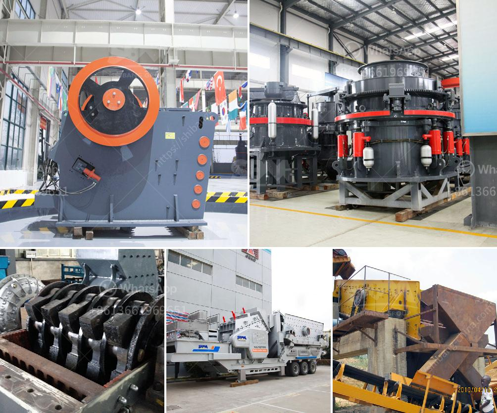

<h3>stone crusher philippines</h3>
Stone crusher Philippines or rock crusher Philippines can produce 40-500 tons per hour and can crush 8 to 10 inches diameter boulder capacity etc. Stone crusher or rock crusher is a kind of crushing machine, which can crush various large, medium and small sized ores, rocks (granite, lime stone and concrete). The granularity of the materials should be not more than 120-500mm and compression strength of the materials should be not more than 320 MPa.

It is widely used in mining, smelting, building materials, highway, railway, water conservancy and chemical industries and other industries. The stone crusher or rock crusher can crush and granulate various materials. For instance, the stone crusher or rock crusher is suitable for crushing coal, limestone, cement clinker, feldspar, and so on.

With the increasing requirements of the construction industry, more and more mining and construction companies are setting up stone crushing factories. Although there are quite a few manufacturers of stone crushers in the market, not all of them can provide secure and reliable crushers. Nowadays, the competition in the market of stone crushers has been gradually increasing. The Philippines is rich in minerals, but less satisfactory in terms of processing technology. In order to promote the development of processing technology and improve the level of equipment, the Philippine government has taken various measures. For example, the Philippine government supports the construction of infrastructure, transportation, power and other basic industries, and promotes the market development of impact crushers and pulverizing mills.

As the main primary stone crusher, jaw crusher is mainly used to break large and hard materials. In order to crush the hard materials, the jaw crusher has a compressive strength of 320 MPa and has a large crushing ratio. It has been widely used in mining, smelting, building materials, highways, railways, water conservancy, and chemical industries and other industries.

The impact crusher, also known as the impact crusher, is a medium-to-fine crushing operation that can be applied to a variety of stones, rocks, construction was solution skill in mining operations, etc. Its output ranges from 30mm to 1200 mm. The output size of the equipment varies from 3mm to 1200mm. The configuration of the impact crusher is a crushing and screening device arranged in a van with a jaw crusher and a cone crusher. The impact crusher uses the impact principle to crush materials. The material enters the crushing chamber and is immediately broken by the impact of the board hammer and the angle iron on the rotor. The material can also be returned to the crushing chamber to be broken again.

In conclusion, stone crusher Philippines or rock crusher Philippines can produce 40-500 tons per hour and can crush 8 to 10 inches diameter boulder capacity etc. Stone crusher or rock crusher is a kind of crushing machine, which can crush various large, medium and small sized ores, rocks (granite, lime stone and concrete).
<h3>Contact us</h3><ul><li><strong>Whatsapp:&nbsp;<a href="https://wa.me/8613661969651">+8613661969651</a></strong></li><li><a href="https://swt.shibang-china.com/?git&amp;zhl&amp;stone crusher philippines"><strong>Online Service(chat now)</strong></a></li></ul><h3>Related</h3><ul><li><a href='jaw crusher plant 20 tph.md'>jaw crusher plant 20 tph</a></li><li><a href='m sand crushing manufacturers in india.md'>m sand crushing manufacturers in india</a></li><li><a href='china raymond roller mills.md'>china raymond roller mills</a></li><li><a href='feldspar powder morbi.md'>feldspar powder morbi</a></li><li><a href='feldspar quarry processing plant.md'>feldspar quarry processing plant</a></li></ul>