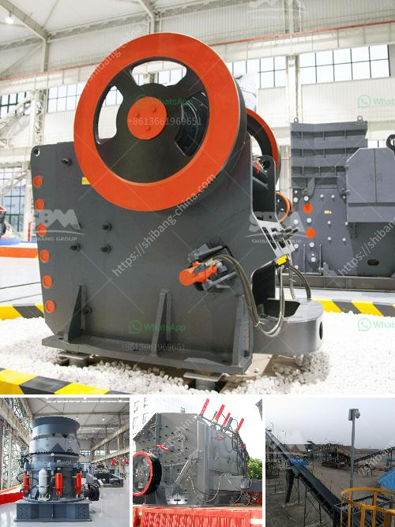

<h3>stone crusher plant hire gold in zimbabwe</h3>
A world leader in equipment for rock and mineral processing, massive 15-tonne stone crusher was transported from its remote location to the capital, Harare. This was no small task as the only way to get it out of the remote area was by helicopter, making the project even more remarkable.

The gold mining industry in Zimbabwe is one of the main contributors to the economy of the country. As a result, there is a significant amount of gold ore being processed by the collective efforts of small-scale miners and large-scale industrial mining companies.

One of the key challenges in the gold mining industry is the need for effective crushing solutions. A stone crusher plant is a machine designed to break large rocks into a more manageable size, enabling efficient processing of gold ore, which is a valuable resource for any country.

Many artisanal miners have been mining gold in Zimbabwe for centuries. They use primitive tools and equipment, often working in dangerous conditions. Industrial mining companies, on the other hand, rely on heavy machinery and advanced technology to extract gold on a large scale.

Due to the increased demand for gold, there is now a critical need for efficient crushing solutions in the gold mining industry. Hiring a stone crusher plant is a cost-effective way to improve the efficiency and productivity of mining operations.

By hiring the right equipment from a reputable company, you can ensure that the equipment is maintained and in good working condition throughout the duration of the project. Stone crusher plant hire offers a flexible, cost-effective and reliable solution, minimizing downtime and maximizing productivity.

Hiring a stone crusher plant can be a great way to streamline and improve the efficiency of mining operations. Whether you are a small-scale miner or a large-scale industrial mining company, utilizing a stone crusher plant provides several benefits:

1. Increased production: The use of a stone crusher plant enables you to process more gold ore in a shorter time, increasing overall productivity.

2. Reduced labor costs: By hiring a stone crusher plant, you can reduce the need for manual labor, freeing up your workforce to focus on other important tasks.

3. Improved safety: Stone crusher plants are designed with safety in mind, reducing the risk of accidents and injuries in the workplace.

4. Minimized environmental impact: Stone crusher plants are designed to minimize environmental impact, ensuring compliance with environmental regulations.

Stone crusher plant hire is a cost-effective, efficient, and reliable solution for the mining industry. Whether you are a small-scale miner or a large-scale industrial mining company, stone crusher plants can help streamline operations, reduce downtime, and increase productivity. By hiring the right equipment from a reputable company, you can ensure improved efficiency and maximize the production of gold in Zimbabwe.
<h3>Contact us</h3><ul><li><strong>Whatsapp:&nbsp;<a href="https://wa.me/8613661969651">+8613661969651</a></strong></li><li><a href="https://swt.shibang-china.com/?git&amp;zhl&amp;stone crusher plant hire gold in zimbabwe"><strong>Online Service(chat now)</strong></a></li></ul><h3>Related</h3><ul><li><a href='ore processing plant for sale.md'>ore processing plant for sale</a></li><li><a href='250 400 pe jaw crusher price list.md'>250 400 pe jaw crusher price list</a></li><li><a href='gold processing equipment for sale in zimbabwe.md'>gold processing equipment for sale in zimbabwe</a></li><li><a href='crusher plant in nigeria pakistan.md'>crusher plant in nigeria pakistan</a></li><li><a href='conventional hammer mill.md'>conventional hammer mill</a></li></ul>