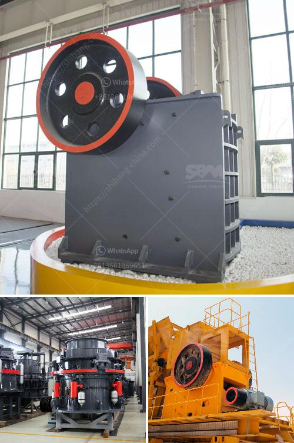

<h3>stone crusher plant in turkey</h3>
Turkey is a country located in Eurasia. It is surrounded by the Mediterranean Sea to the south, the Aegean Sea to the west, and the Black Sea to the north. It has a population of about 82 million people, making it the 18th most populous country in the world. Turkey has a mixed economy with a strong industrial and agricultural sectors.

Stone crusher plants are designed to process various rocks and ores, such as limestone, granite, basalt, iron ore, gold ore and copper ore. Turkey has a rich variety of mineral resources, and most of Turkey's rocks are limestone with a few exceptions like marble. Turkish natural stones are famous worldwide, especially the country's white marble varieties, which are widely used in both historical buildings and modern constructions.

The stone crusher plant is used for producing sand, rock and stone for construction, highway, railway and other applications. Fote Heavy Machinery, with 40 years of experience in the stone crushing production line, is skilled in the production line process design and has a high-cost performance.

In recent years, with the increasing demand for sand, there have been more sand mining operations across the globe. Especially in Turkey, the construction sector has been growing rapidly, which requires a great amount of sand and aggregates. Many quarries and mining companies in Turkey have realized this fact and started investing in sand making and crushing plants.

With the development of infrastructure in Turkey, construction waste is increasing rapidly. This has caused an increase in the demand for crushing machinery. Fote Crushing Plants provide a new field of business opportunities for contractors, quarry operators, recycling and mining applications. It offers high efficient and low-cost project plan without environment limit for the client.

The features of the stone crusher plant in Turkey are high efficiency, low cost, and powerful adaptability. The finished product can be used for site construction or high-speed railway construction, and equipment and installation have a great advantage in time. Compared with the mobile crusher plant design, the fixed crush plant has no tires. In view of the present situation of construction waste disposal, the mobile crush plant has obvious advantage.

According to the construction waste content, you can choose fixed crushing plant equipment and mobile crushing plants respectively. High-quality mobile crushing plants have both on-board and off-board types, which can combine with other crushing machines to easily fulfill different demands. Furthermore, we can design the fixed plant according to the customer's requirements. It is mainly composed of a vibrating feeder, jaw crusher, impact crusher, vibrating screen, belt conveyor, and other equipment.

Turkey's construction sector has been experiencing a booming period in recent years, which has led to a significant increase in the demand for stone crusher plants. This trend is expected to continue in the coming years. With its favorable geographical location, abundant natural resources, and strong infrastructure development, Turkey is becoming an increasingly attractive market for stone crusher plant manufacturers.
<h3>Contact us</h3><ul><li><strong>Whatsapp:&nbsp;<a href="https://wa.me/8613661969651">+8613661969651</a></strong></li><li><a href="https://swt.shibang-china.com/?git&amp;zhl&amp;stone crusher plant in turkey"><strong>Online Service(chat now)</strong></a></li></ul><h3>Related</h3><ul><li><a href='crusher plant in nigeria pakistan.md'>crusher plant in nigeria pakistan</a></li><li><a href='jaw crusher sale uk.md'>jaw crusher sale uk</a></li><li><a href='crushed price impact crusher price.md'>crushed price impact crusher price</a></li><li><a href='clay brick making equipment south africa.md'>clay brick making equipment south africa</a></li><li><a href='hammer mill crusher type.md'>hammer mill crusher type</a></li></ul>