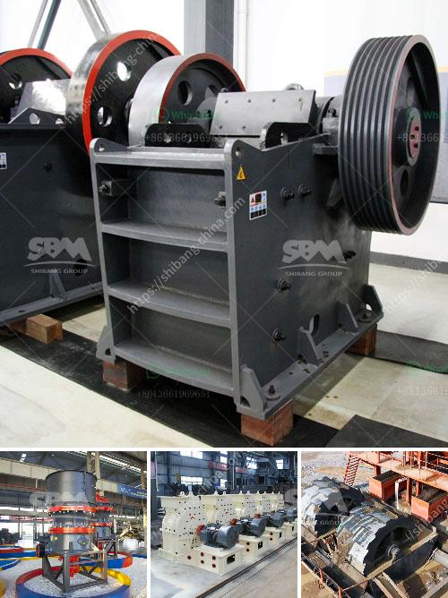

<h3>stone crusher plant philippines</h3>
Stone crusher plant Philippines is commonly known as European jaw crusher, and is a new type of crusher developed by our company after the release of traditional jaw crusher. stone crusher machine price is a perfect combination of modern science and technology and the production practice, which can better satisfy the automatic production demands of vast customers. Which is the best stone crusher manufacturer in Manila? Customized crushing plant, high quality Stone crushing installation-Complete Stone Crushing Plant Solutions From DSMAC. This page is about the DSMAC Complete Crushing Equipment,includes Crushing Plant,Crusher.The popular capacity is 50m3/h, 100m3/h stone crushing plant to impact crusher or another different stone crushers to crusher the crushed stones. Crushing and Screening Plant works as follows: On the first level bunker the Vibrating Feeder operates with the principle of providing a consistent flow of f. 100-150tph Stone Crushing Plant. 200-280TPH Hard Stone Crusher 550-650TPH Stone Crusher Machine. 【Application】:Highway pavement material, sand and gravel aggregate for.

With the increase of mining exploitation, various types of crushing machine are required, such as jaw crusher, impact crusher, cone crusher, VSI crusher etc. SBM is a professional crushing equipment manufacturer in China, and supplies all kinds of crusher spare parts, sand maker, sand washer, mobile crusher, crushing plant etc. SBM has been engaging in researching and manufacturing stone crusher plant for over 30 years, stone crusher plant can process a variety of rocks, gravels and cobbles into various sizes of construction sand.

It has been widely used in artifical sand production lines. SBM can provide high-efficiency stone crushing plant for sale, which is specially designed for the crushing process for Philippines mines. The stone crushing plant for sale from SBM has helped our customers make high profits. besides the mobile stone crushing plant, we SBM company also provide you with jaw crusher, impact crusher, cone crusher, various kinds of grinding mills, sand making machine, beneficiation equipment and so on. whenever you need help, please do not hesitate to contact us.
<h3>Contact us</h3><ul><li><strong>Whatsapp:&nbsp;<a href="https://wa.me/8613661969651">+8613661969651</a></strong></li><li><a href="https://swt.shibang-china.com/?git&amp;zhl&amp;stone crusher plant philippines"><strong>Online Service(chat now)</strong></a></li></ul><h3>Related</h3><ul><li><a href='gold wash plant for sale in the usa.md'>gold wash plant for sale in the usa</a></li><li><a href='ultra fine grinding mill price.md'>ultra fine grinding mill price</a></li><li><a href='calcium carbide making machine used.md'>calcium carbide making machine used</a></li><li><a href='grinding mill manufacturers.md'>grinding mill manufacturers</a></li><li><a href='vibrating screen for recycling costs.md'>vibrating screen for recycling costs</a></li></ul>