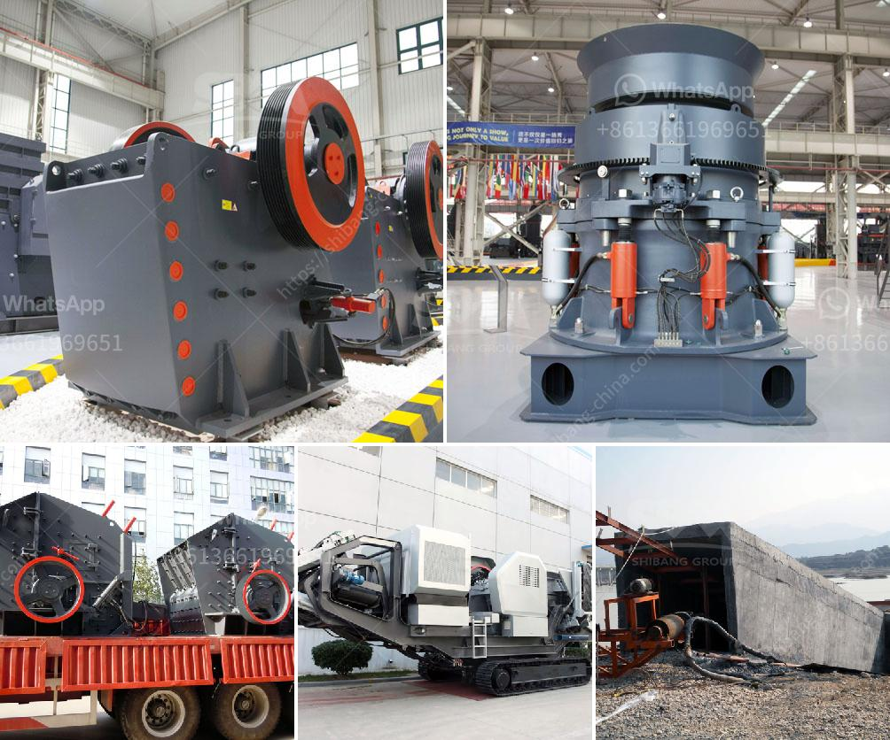

<h3>stone crusher plant price list</h3>
So, you want to set up an stone crushing plant, you are probably considering the factors that will determine the price of the stone crusher plant.  First, and foremost, the technical specifications and capacity of the plant will determine the price. Rarely is the capacity of the stone crusher plant mandatory to choose, as plants normally have intermittent workloads. Still, you can buy an excellent crusher plant that suits your needs without compromising quality.

The second factor is the demand for the final product. If the demand is high for a particular construction material, for example, gravel, or if you have a high-quality sand quarry, stone crushing plants may be a great investment. On the other hand, there are certain factors that you need to consider before investing in a stone crushing plant. Here are some relevant points.

First, you need to consider the overall scope of the project. When you purchase a crushing plant, you must consider the number of different items you will need to address the complexities of the project. Do you need to transport the machine on a trailer? Will you need a generator of a specific size to power the plant? What kind of excavator will you need to work in the quarry? All of these factors need to be taken into account as they will have an impact on the final price.

The size of the stone crushing plant can also play a crucial role in determining the overall price. Most notably, you'll need to consider the required capacity for each specific product you plan to produce. Additionally, you'll need to adjust the crushing machine's size to increase its productivity and reduce energy consumption. 

Another factor to consider is the location where you plan to install the crushing plant. Different regions have different regulations and requirements for crushing plants. For example, some areas require environmental permits and rigorous emission standards. These regulations can increase the overall cost of the plant, as you may need additional equipment to meet the required standards. It's essential to research and understand the regulations and requirements of your location to ensure compliance.

Furthermore, the quality of the machinery is an essential aspect to consider when purchasing a stone crushing plant. Opting for high-quality machinery will ensure a more reliable and durable plant. Although high-quality machinery may come at a higher price, the long-term benefits outweigh the initial investment. 

In conclusion, there are several factors that determine the price of a stone crusher plant. These include technical specifications, capacity, demand for the final product, scope of the project, size of the plant, location, and the quality of the machinery. Investing in a high-quality stone crushing plant will provide consistent and efficient performance for your construction projects, ensuring maximum profitability. Therefore, it is essential to consider all these aspects before finalizing your purchase decision.
<h3>Contact us</h3><ul><li><strong>Whatsapp:&nbsp;<a href="https://wa.me/8613661969651">+8613661969651</a></strong></li><li><a href="https://swt.shibang-china.com/?git&amp;zhl&amp;stone crusher plant price list"><strong>Online Service(chat now)</strong></a></li></ul><h3>Related</h3><ul><li><a href='rotary kiln untuk pengeringan batu kapur kapur.md'>rotary kiln untuk pengeringan batu kapur kapur</a></li><li><a href='stone crusher output per hour india.md'>stone crusher output per hour india</a></li><li><a href='used crusher stone sale tanzania.md'>used crusher stone sale tanzania</a></li><li><a href='advantages and disadvantages of ball mill grinding.md'>advantages and disadvantages of ball mill grinding</a></li><li><a href='stone crusher primary jaw to buy in nigeria.md'>stone crusher primary jaw to buy in nigeria</a></li></ul>