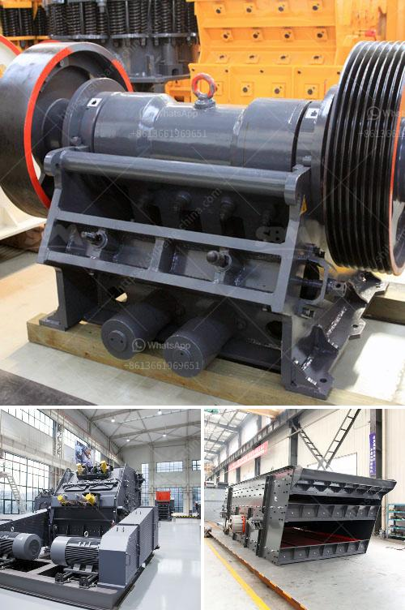

<h3>stone crusher plant project report</h3>
A stone crusher plant is a lucrative venture for new entrepreneurs. The demand for quality stone chips is increasing day-by-day. With the booming construction industry, it is now imperative to setup your own stone crusher plant.

It is also essential to have proper project report in hand before setting up the plant. Even though the traditional stone crusher plant project report is quite crucial, I think that a well-structured project report can help you set up the plant more effectively. Here, I will discuss the major causes for project failure.

We often hear some stone crushing plant owners complain time and again that they did everything and nothing went in the right direction. This happens because they tried to proceed with their stone crushing project without a proper project report. Not having a well-structured project report may create confusion and delays in the set-up of the plant. It may even halt the implementation of your stone crushing plant project altogether.

To ensure that you gain the maximum monetary benefits from your venture, it is recommended that you have a comprehensive stone crusher plant project report.

- Introduction: In this part, the objectives of the report and the background of the project are presented.

- Methodology: In this section, the overall design of the project is described. This includes the data sources, methods used, and any assumptions made during the study.

- Analysis and Findings: This is the meat of the report, where the results of the study are presented.

- It includes a detailed analysis of the market scenario, market trends, project cost, machinery cost, raw materials, expected returns on investment, profit ratio, etc.

- Conclusion: This part summarizes the findings of the report and provides recommendations for the successful implementation of the project.

- It is important to include a risk analysis section as well, where potential risks and their mitigation strategies are outlined.

Having a well-structured project report helps you analyze the feasibility of the project. It also helps you evaluate the risks and rewards associated with the project and make informed decisions. A stone crusher plant project report should include an executive summary, which gives an overview of the whole document without giving away too much detail so that the reader can decide whether to read on or not. It should also include a detailed introduction of the project, as well as an objective and scope of the project.

Having a good project plan is crucial to the success of your stone crushing plant project. Here are some tips to help you obtain the maximum benefits:

1. Consult with industry experts: This can be a great way to gather information about starting your stone crushing plant project. You can also talk to everyday people who own a crushing plant to get a better idea of what it is like to own such a business.

2. Decide what kind of stone crushing plant you want to establish: The design and construction of the plant depends on your specific requirements. You can approach this aspect by talking to people who are already in business and building a stone crushing plant.

3. Determine your target market: This may be the hardest part of the process. Once you have a clear vision, you can start searching for the required stone crushing machinery.

4. Determine the location: Ideally, the location should be close to major construction sites. This helps you facilitate the transportation of crushed stones more conveniently.

5. Purchase necessary equipment: A stone crusher plant project report would include different units for producing different materials.

It is advantageous if the crushed stone unit is set up near the quarries where the granite boulders of various sizes are available for the crushing unit. This can be a major factor in making the project a success. So it is important to have a professional production line design.

In conclusion, a stone crusher plant is an important investment opportunity and gives you the chance to earn money from the construction industry. However, obtaining a successful project report can be challenging if you are unclear about the purpose, audience, and content of the report. To ensure that your project report is effective, you should consult with industry experts and seek their advice. By following the tips mentioned above, you can set up a stone crusher plant that can bring you a great return on investment.
<h3>Contact us</h3><ul><li><strong>Whatsapp:&nbsp;<a href="https://wa.me/8613661969651">+8613661969651</a></strong></li><li><a href="https://swt.shibang-china.com/?git&amp;zhl&amp;stone crusher plant project report"><strong>Online Service(chat now)</strong></a></li></ul><h3>Related</h3><ul><li><a href='gold crusher for sale.md'>gold crusher for sale</a></li><li><a href='mobile crusher di malaysia.md'>mobile crusher di malaysia</a></li><li><a href='mining crusher equipment south africa.md'>mining crusher equipment south africa</a></li><li><a href='70 tph limestone crusher weight.md'>70 tph limestone crusher weight</a></li><li><a href='mobile dimension stone processing.md'>mobile dimension stone processing</a></li></ul>