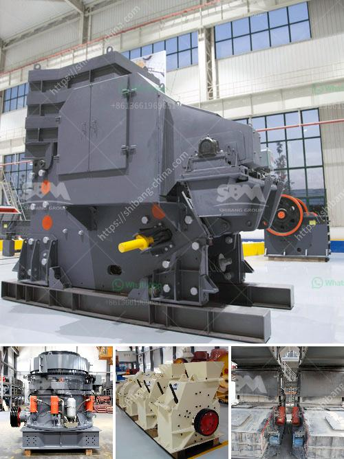

<h3>stone crusher price in ethiopia</h3>
Stone crusher price in Ethiopia is influenced by various factors such as brand, size, specification, equipment durability, staff technology level, and factory direct sales. So the stone crusher price list in Ethiopia is different, but the specific factors affecting the price are as follows:

Because there are many manufacturers of stone crushers, their production technology and processing capacity are different, so the price of stone crusher is different, especially for different manufacturers, their equipment quality is different, so the price will be different.

The quality of the stone crusher is directly related to the crushing efficiency, so the quality of the material in the factory will directly affect the price of the equipment. If the material is of poor quality, it will not only affect the crushing efficiency but also have a certain impact on the service life of the equipment, which will increase the replacement cost of the wearing parts and increase the operating cost of the equipment.

The specifications of the stone crusher are different, and the finished products are different. Therefore, the price of the equipment with different specifications is different. Generally speaking, the price of the small-sized equipment is low, and the price of the large-sized equipment is high. But the specific price is different for different models.

The performance of the stone crusher equipment has a direct impact on the production efficiency of the equipment, so the performance of the equipment needs to be considered when selecting the equipment. Generally, the more advanced the technology, the higher the price. But the advanced technology can greatly improve the production efficiency and output of the equipment.

The technology level of the staff directly affects the quality of the stone crusher equipment. If the technicians are not skilled enough, the quality of the equipment produced will be affected, resulting in a decrease in service life and an increase in failure rate. In order to retain skilled technicians, the cost of equipment will be higher, which will lead to an increase in the price.

In summary, the price of stone crushers in Ethiopia is affected by many factors. So the price of stone crushers in Ethiopia is not fixed, but fluctuates. The specific price of stone crusher depends on the specific model and configuration, either a fixed price or a mobile stone crusher with multiple configurations. 

Such as the price of a stationary crusher plant, a mobile stone crusher plant, and a complete stone crushing production line will vary. These prices are determined by factors such as production capacity, manufacturing costs, and technical input. To ensure the quality and performance of the equipment, manufacturers will carefully consider and optimize the equipment. Therefore, the price of these crushers is relatively higher than ordinary crushers.

We will provide customers with competitive prices according to their budgets and needs. We also offer free consultation services to our customers, so if you have any questions or need further information, please feel free to contact us. We are committed to providing the best stone crusher price in Ethiopia and ensuring that our customers are satisfied with our products and services.
<h3>Contact us</h3><ul><li><strong>Whatsapp:&nbsp;<a href="https://wa.me/8613661969651">+8613661969651</a></strong></li><li><a href="https://swt.shibang-china.com/?git&amp;zhl&amp;stone crusher price in ethiopia"><strong>Online Service(chat now)</strong></a></li></ul><h3>Related</h3><ul><li><a href='crawler mobile jaw crusher for sale.md'>crawler mobile jaw crusher for sale</a></li><li><a href='silica sand quarry for sale in tunisia in cork ireland.md'>silica sand quarry for sale in tunisia in cork ireland</a></li><li><a href='ball mill for powder.md'>ball mill for powder</a></li><li><a href='mining hammer mill suppliers.md'>mining hammer mill suppliers</a></li><li><a href='want to increase productivity for stone crushers.md'>want to increase productivity for stone crushers</a></li></ul>