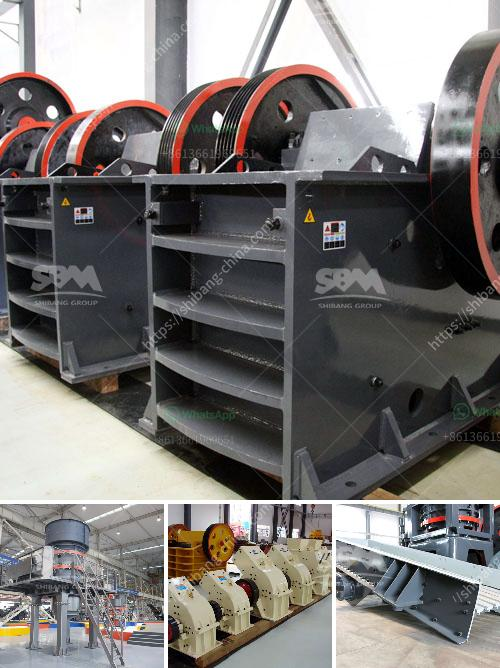

<h3>stone crusher price list</h3>
A stone crusher is a machine that breaks down large rocks into small pieces. There are various types of stone crushers in the market, such as jaw crusher, cone crusher, impact crusher, compound crusher, roller crusher, etc. Although these crushers have different specifications, they all belong to the same type of crushing equipment.

In general, the price of a stone crusher is affected by several factors, including the following aspects:

Before purchasing a stone crusher machine, you should compare prices among different distributors or manufacturers. Some manufacturers may offer competitive prices, whereas others may be exorbitantly priced. If you want to find a trustworthy supplier, you can search for stone crusher price list on various websites. On these websites, you can often find customer reviews and ratings, which will help you assess the reliability of different suppliers.

The quality of the machine directly affects its performance and longevity. A high-quality stone crusher is built to withstand extreme conditions and prolong its service life. Regular maintenance is also crucial in ensuring that the machine remains in good working order. When comparing prices, it is essential to consider the quality of the machine. A slightly more expensive machine that guarantees durability and reliability is often a better choice in the long run.

Different stone crushers have different specifications and functionalities. The capacity, power, speed, and size of the machine will all affect its price. For instance, a small stone crusher with a capacity of 10 tons per hour may cost around $350,000, while a large stone crusher with a similar capacity of 300 tons per hour may cost around $3 million. If you want to invest in a stone crusher with high capacity and low cost, the best choice is to look for a reputable supplier with a comprehensive stone crusher price list.

The demand for stone crushers is influenced by several factors, such as housing construction, infrastructure development, and industrial production. When these industries are thriving, the demand for stone crushers increases significantly, leading to a rise in prices. In contrast, during an economic slowdown or recession, the demand for stone crushers may decline, causing prices to drop. Understanding market demand can help you make informed decisions about when to purchase a stone crusher and at what price.

Apart from the initial purchase price, you should also consider the cost of transporting the stone crusher to your desired location and its subsequent installation. These costs may vary depending on the distance and complexity of the installation process. It is important to factor in these additional expenses when evaluating the overall affordability of a stone crusher.

In conclusion, finding the right stone crusher at an affordable price can be a challenging task. By considering various factors such as price comparison, machine quality, specifications, market demand, and transportation/installation costs, you can make an informed decision. Remember, investing in a high-quality stone crusher may require a larger upfront investment, but it can save you substantial costs in the long run.
<h3>Contact us</h3><ul><li><strong>Whatsapp:&nbsp;<a href="https://wa.me/8613661969651">+8613661969651</a></strong></li><li><a href="https://swt.shibang-china.com/?git&amp;zhl&amp;stone crusher price list"><strong>Online Service(chat now)</strong></a></li></ul><h3>Related</h3><ul><li><a href='chinese mobile crusher.md'>chinese mobile crusher</a></li><li><a href='cone crusher for hire south africa.md'>cone crusher for hire south africa</a></li><li><a href='ball mill for powder.md'>ball mill for powder</a></li><li><a href='pebbel stone crusher.md'>pebbel stone crusher</a></li><li><a href='plant of bentonite crusher.md'>plant of bentonite crusher</a></li></ul>