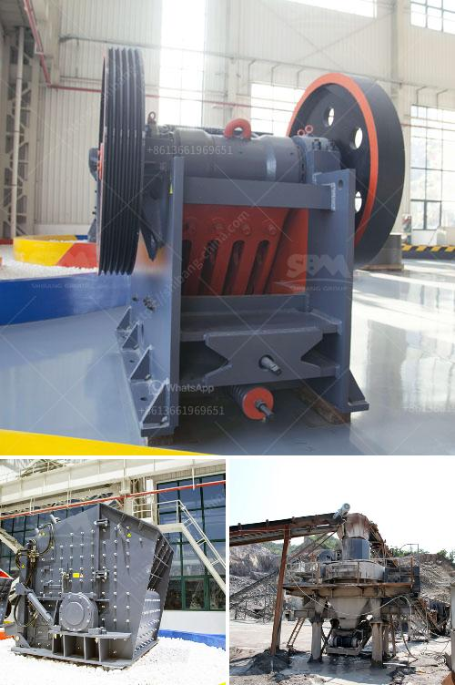

<h3>stone crusher price per</h3>
Stone crusher machines play an important role in the mining industry, as they are used to break down large rocks and stones into smaller pieces for further processing. The stone crusher price per ton varies depending on the type and size of the machine as well as the specific requirements of the project.

When calculating the cost of stone crushing, several factors come into play. These include the type of stone to be crushed, its hardness, and its size. The size of the machine required to crush the stone also affects the price. Generally, larger machines are more expensive as they have a higher capacity to process larger rocks.

In addition to these factors, transport and delivery costs also contribute to the overall price. Stone crushers are heavy machines that require special transportation methods. Depending on the distance and location, these costs can vary significantly.

However, it is important to note that the price per ton is not the sole determining factor when choosing a stone crusher. Quality, efficiency, and reliability are equally important. The machine should be able to produce the desired output and perform consistently over time.

To get an accurate idea of the stone crusher price per ton, it is advisable to contact several suppliers and request quotes. By comparing these quotes and evaluating the features and specifications of each machine, one can make an informed decision.

Investing in a reliable stone crusher is crucial for any mining operation. It helps to enhance productivity and decrease operational costs in the long run. Therefore, taking into account factors such as price, quality, and efficiency is essential when considering the purchase of a stone crusher.
<h3>Contact us</h3><ul><li><strong>Whatsapp:&nbsp;<a href="https://wa.me/8613661969651">+8613661969651</a></strong></li><li><a href="https://swt.shibang-china.com/?git&amp;zhl&amp;stone crusher price per"><strong>Online Service(chat now)</strong></a></li></ul><h3>Related</h3><ul><li><a href='usinas de asfalto para venda em angola.md'>usinas de asfalto para venda em angola</a></li><li><a href='trading industrial stone crushers.md'>trading industrial stone crushers</a></li><li><a href='grinding mill cocoa powder plant duyvis.md'>grinding mill cocoa powder plant duyvis</a></li><li><a href='small mobile gold grinding mill in philippines.md'>small mobile gold grinding mill in philippines</a></li><li><a href='crushing machine for ceramic raw materials.md'>crushing machine for ceramic raw materials</a></li></ul>