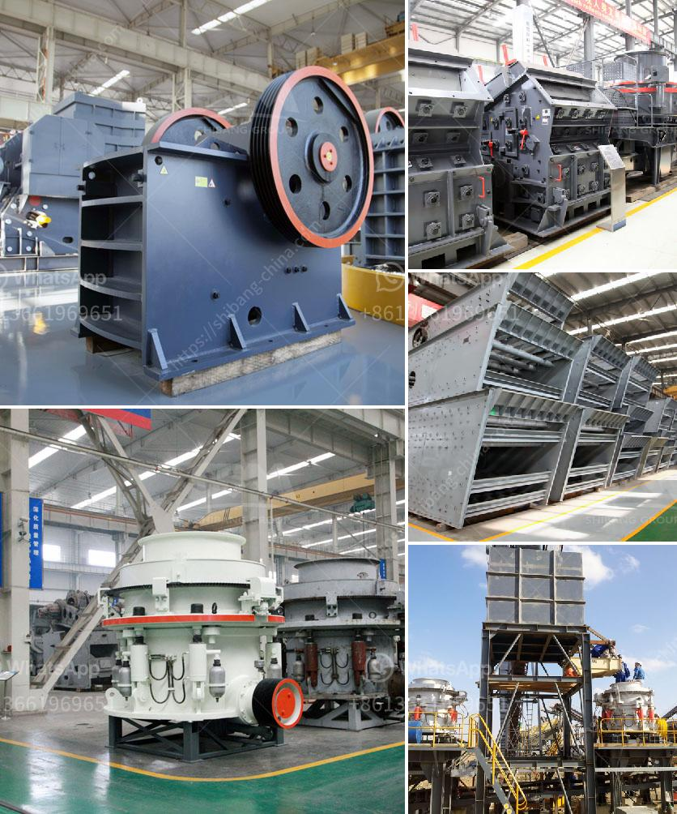

<h3>stone crusher primary jaw to buy in nigeria</h3>
Nigeria is a vibrant country blessed with various natural resources. One of these resources is stone, which is used for various purposes such as construction, road building, agriculture, etc. Stone crushers are used to reduce particle size enough so that the material can be processed into finer particles in a grinder. It is a must-have machine in road construction and other related projects.

Buying a stone crusher in Nigeria can be a bit challenging due to the availability of many brands and varieties. The market is also filled with different types of stone crushers, each having its own unique features and benefits. Therefore, it is important to carefully consider your needs before making a final decision.

The primary jaw crusher is an important piece of equipment used in the primary crushing process in various industries. It is designed to crush large chunks of rock or ore into manageable sizes. The primary jaw crusher has a proven track record in the aggregate and mining industries as a reliable and efficient machine.

When buying a primary jaw crusher, it is necessary to consider the maximum feeding size, capacity, motor power, and other specifications. Additionally, factors such as maintenance requirements, availability of spare parts, and after-sales service should also be taken into account. Buying from a reputable manufacturer or supplier is crucial to ensure durability and value for money.

In Nigeria, there are a few reputable manufacturers and suppliers of stone crushers. Some of them include these well-established companies:

1. C&M Mining Machinery: C&M Mining Machinery is a leading manufacturer of stone crushers, mills, and other mining equipment. Their stone crushers are specifically designed to meet the unique needs of the Nigerian market. They have a diverse range of jaw crushers, cone crushers, and impact crushers.

2. Terex: Terex is a global leader in the production of crushing and screening equipment. They offer a full range of jaw crushers suitable for a wide range of applications. Their primary jaw crushers are highly efficient and require less maintenance than other models.

3. Sandvik: Sandvik is a Swedish company specializing in mobile crushing and screening equipment. They have a range of jaw crushers suitable for various applications. Sandvik primary jaw crushers are known for their high performance and reliability.

Before purchasing a primary jaw crusher, it is advisable to visit the manufacturer's website or contact their sales representatives to gather more information. Get detailed specifications, request quotes, and compare prices from different suppliers to make an informed buying decision.

In conclusion, buying a stone crusher primary jaw in Nigeria can be a great investment when done with proper research and consideration. The primary jaw crusher is an essential tool for performing various crushing tasks efficiently and effectively. It is important to choose a reliable and reputable manufacturer or supplier to ensure the durability and performance of the machine. By considering all the factors mentioned above, you can make an informed decision and find the perfect primary jaw crusher for your needs.
<h3>Contact us</h3><ul><li><strong>Whatsapp:&nbsp;<a href="https://wa.me/8613661969651">+8613661969651</a></strong></li><li><a href="https://swt.shibang-china.com/?git&amp;zhl&amp;stone crusher primary jaw to buy in nigeria"><strong>Online Service(chat now)</strong></a></li></ul><h3>Related</h3><ul><li><a href='crushing and screening equipment prices south africa.md'>crushing and screening equipment prices south africa</a></li><li><a href='china clay processing plant cost in india.md'>china clay processing plant cost in india</a></li><li><a href='stone crusher vibrating screen manila.md'>stone crusher vibrating screen manila</a></li><li><a href='types of limestone crusher.md'>types of limestone crusher</a></li><li><a href='crusher plant for sale in pakistan.md'>crusher plant for sale in pakistan</a></li></ul>