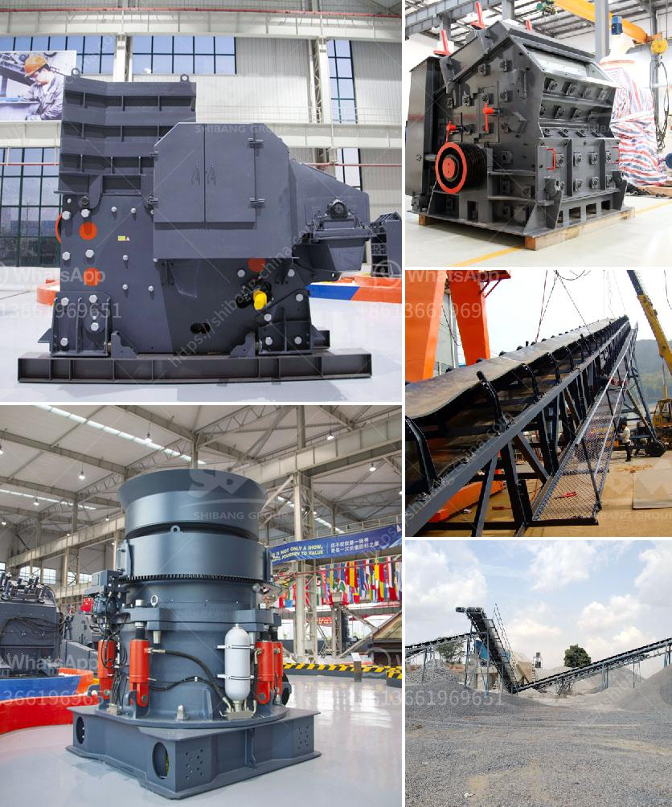

<h3>stone crusher rotary screen in karnataka</h3>
Stone Crusher Rotary Screen in Karnataka is a versatile equipment that is used to crush stones and segregate them into various sizes for further processing. This machine is widely used in mining, building materials, metallurgy, electric power, water conservancy, transportation and many other industries. The rotary screen is a key component of the stone crusher plant, which is mainly responsible for screening the crushed materials. However, its design and working principle have been very innovative, which improves the screening efficiency.

The rotary screen used in the stone crusher plant can classify the materials into various sizes. It has simple structure, easy installation, high production capacity, and screening efficiency. The circular vibrating screen is made of elliptical motion. It is a multi-layer, high-efficiency new type of vibrating screen designed specifically for quarry screening stones. The circular vibrating screen follows the appointment of an eccentric vibrator, which leads the circular vibrating screen to vibrate in a specific trajectory and has high screening efficiency. Due to the use of the eccentric block as an exciting force, the circular vibrating screen has the advantages of small vibration, low noise, and durability. It also has the characteristics of high screening accuracy and high screening efficiency.

The stone crusher rotary screen uses a circular sieve surface, which has high sieving efficiency, large processing capacity, and long service life. The circular vibratory screen is very easy to install and operate. It is mainly composed of a motor, a screen, a vibrator, a damping spring device, and a base frame. The motor drives the eccentric block of the vibration exciter to rotate at a high speed. The rotating eccentric block generates a large centrifugal force, which excites the screen box to produce circular motion with a certain amplitude. The materials on the sieve surface continuously do a round trip tumbling motion in front and behind the sieve. Through repeated tumbling and movement, the materials gradually become loose and stratified, so as to achieve the purpose of screening.

The stone crusher rotary screen not only improves the screening efficiency of the materials but also reduces the equipment wear. The impact force of the materials on the screen surface is small, so it has a longer service life, less maintenance, and less wear on the screen surface. The screen used in the rotary screen is made of wear-resistant materials, which can bear large impact force and have a long service life. In addition, the advanced structure design of the screen frame and the optimized angle of the screen surface further ensure the uniform distribution of the materials on the screen surface and improve the screening efficiency.

In conclusion, the stone crusher rotary screen in Karnataka plays an important role in crushing and screening. It is widely used in various industries to crush stones and screen the materials. With the advancement of technology and the increasing requirements of customers, this equipment will continue to develop and innovate, providing more efficient and reliable screening solutions.
<h3>Contact us</h3><ul><li><strong>Whatsapp:&nbsp;<a href="https://wa.me/8613661969651">+8613661969651</a></strong></li><li><a href="https://swt.shibang-china.com/?git&amp;zhl&amp;stone crusher rotary screen in karnataka"><strong>Online Service(chat now)</strong></a></li></ul><h3>Related</h3><ul><li><a href='pure north crushing plant.md'>pure north crushing plant</a></li><li><a href='price for sand machine.md'>price for sand machine</a></li><li><a href='how to make industrial talcum powder.md'>how to make industrial talcum powder</a></li><li><a href='vertical vertical roller mill drives.md'>vertical vertical roller mill drives</a></li><li><a href='hot selling coal mine roller crushing plant in india.md'>hot selling coal mine roller crushing plant in india</a></li></ul>