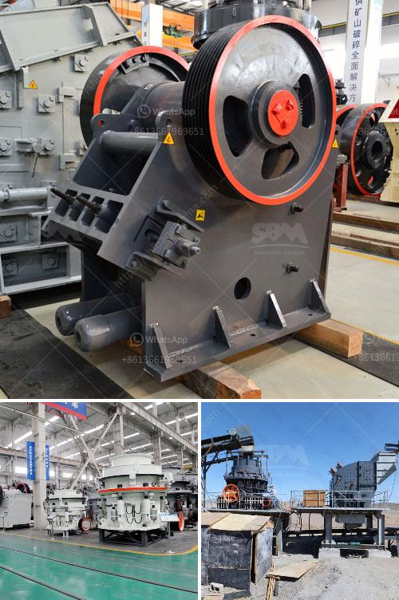

<h3>stone crusher sample business plan</h3>
A stone crushing business plan is a formal statement of a set of business goals they want get, the reasons they are believed attainable, and the detail plan for reaching those goals. In most cases a stone crushing business plan will outline the goals and objectives of the company and how it plans to achieve them.

A stone crusher business plan also includes a financial plan for the business. The business owners or investors need to include a statement financial projections and cash flow along with the balance sheet and income statement. These financial statements will tell the investors or banks how profitable the business is going to be and when they can expect to recoup their initial investment. 

1. Introduction: Introduce the stones crusher business and let potential investors know about the nature of the business, the background of the management team, and any other relevant information that will help them make an informed decision.

2. Goals and Objectives: Outline the short-term and long-term goals of the business and the specific objectives that need to be accomplished in order to achieve those goals. This section should also include a description of the products or services the business will offer and an analysis of the target market and competition.

3. Financial Plan: Provide a detailed financial plan that includes projected revenue, expenses, and cash flow for the company. This section should include information about the startup costs, funding sources, and the expected return on investment.

Overall, a stone crushing business plan provides a clear roadmap for building a successful enterprise. It helps the business owners and investors understand the potential risks and rewards involved in the industry and make informed decisions.
<h3>Contact us</h3><ul><li><strong>Whatsapp:&nbsp;<a href="https://wa.me/8613661969651">+8613661969651</a></strong></li><li><a href="https://swt.shibang-china.com/?git&amp;zhl&amp;stone crusher sample business plan"><strong>Online Service(chat now)</strong></a></li></ul><h3>Related</h3><ul><li><a href='items for conveyor belts.md'>items for conveyor belts</a></li><li><a href='used crusher price in uk.md'>used crusher price in uk</a></li><li><a href='clay brick making equipment south africa.md'>clay brick making equipment south africa</a></li><li><a href='chinese mobile crusher.md'>chinese mobile crusher</a></li><li><a href='sand mining equipment manufacturer in south africa.md'>sand mining equipment manufacturer in south africa</a></li></ul>