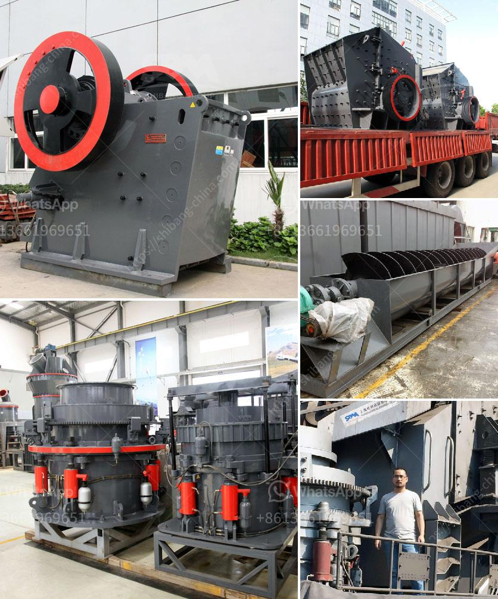

<h3>stone crusher uganda</h3>
Stone Crusher Uganda is the perfect investment for those looking to invest in a stone crusher plant. It not only provides continuous operation but also ensures maximum efficiency and output. With the ample resources available in Uganda, the investment potential in stone crushing plant is huge.

Stone crushing plants have been operating in Uganda for many years. Some of the crushing plants have had to close down due to the unavailability of materials in their vicinity or high costs of operation. However, this has not deterred individuals and companies from starting new stone crushing plants. They have seen the enormous potential in the stone crushing industry and have taken a plunge into it.

The stone crusher industry in Uganda has been growing rapidly due to increasing demand from the construction and infrastructure sectors. The enormous infrastructural projects planned throughout Uganda continue to drive demand for aggregates, building stones, and sand. This is where stone crushers come into play.

A stone crusher is a machine designed to break large rocks into smaller rocks, gravel, sand, or rock dust. Crushers may be used to reduce the size, or change the form, of waste materials so they can be more easily disposed of or recycled, or to reduce the size of a solid mix of raw materials, making them easier to differentiate.

Investing in a stone crusher Uganda offers several advantages. Firstly, it helps in reducing the cost of transportation due to the availability of raw materials near the site of construction. This results in saving time and money, enabling the construction project to be completed faster and more efficiently.

Secondly, stone crushing plants in Uganda have a high resale value and generate additional income for the owner. If the owner decides to sell the plant after a few years of operation, they can expect to receive a good return on investment.

Lastly, stone crushers in Uganda also contribute to employment generation. The majority of the tasks related to stone crushing require manual labor, creating job opportunities for the local population.

In conclusion, investing in a stone crusher Uganda is a wise choice for anyone looking to tap into the booming construction and infrastructure sectors. With the increasing demand for aggregates, building stones, and sand, stone crushing plants in Uganda are poised to take advantage of the lucrative market.
<h3>Contact us</h3><ul><li><strong>Whatsapp:&nbsp;<a href="https://wa.me/8613661969651">+8613661969651</a></strong></li><li><a href="https://swt.shibang-china.com/?git&amp;zhl&amp;stone crusher uganda"><strong>Online Service(chat now)</strong></a></li></ul><h3>Related</h3><ul><li><a href='limestone processing crusher.md'>limestone processing crusher</a></li><li><a href='pebbel stone crusher.md'>pebbel stone crusher</a></li><li><a href='desain hammer mill dengan pelat rotor pdf.md'>desain hammer mill dengan pelat rotor pdf</a></li><li><a href='jaw crusher moby 600.md'>jaw crusher moby 600</a></li><li><a href='dolomite powder making.md'>dolomite powder making</a></li></ul>