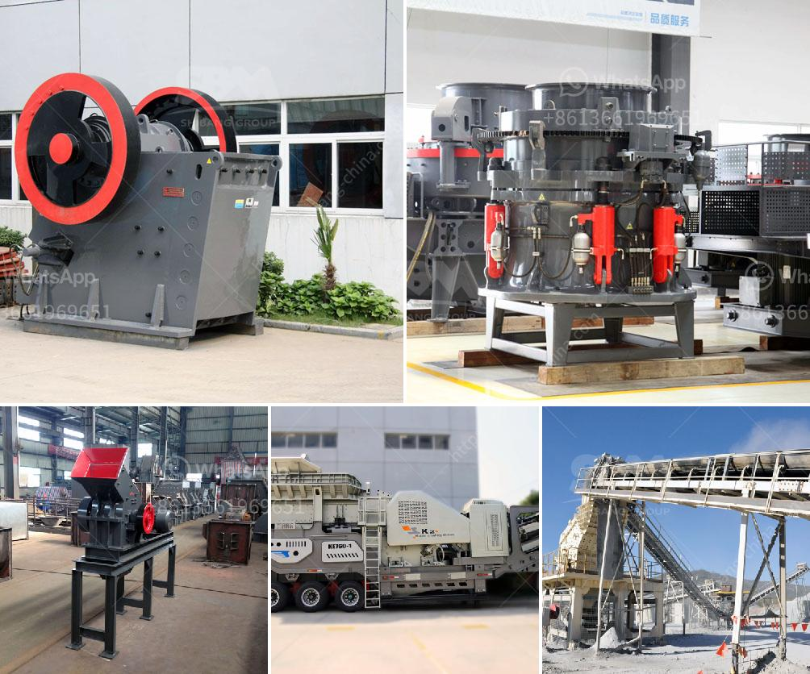

<h3>stone crusher united states project</h3>
Stone crushing plants constitute an important industrial sector in the United States. The construction industries in the country are experiencing a boom as a result of the growing demand for stone aggregates and the increasing use of these materials in various construction activities. Stone crushers are machines that are designed to reduce the size of rocks or gravel, making them suitable for use in various construction projects. In this article, we will discuss the stone crusher United States project and provide an overview of the industry.

The stone crushing industry in the United States is primarily driven by the increasing demand for aggregates used in the construction of roads, bridges, airports, and buildings. The demand for aggregates is directly proportional to the growth of the construction industry. As the population continues to grow, the need for infrastructure development has also increased, further driving the demand for stone aggregates.

Stone crushers are machines used to crush large rocks into smaller-sized rocks or gravel. They are commonly used in the construction industry to produce gravel for use in various construction activities. Stone crushing plants typically have different types of crushers, including jaw crushers, impact crushers, cone crushers, and vibrating screens. Each type of crusher is used for specific purposes and has its advantages and limitations.

The stone crusher United States project involves the installation of a crushing plant at a quarry where large rocks and stones are mined. The crushed stones or aggregates obtained from the plant are used in various construction applications, such as in the production of concrete, asphalt, and road base materials. The stone crusher plant is an essential infrastructure facility in any construction project.

To carry out the stone crusher United States project, a large amount of capital investment is required. The project involves the acquisition of land, machinery, and equipment, and the construction of new infrastructure. The project also requires the hiring of qualified personnel, such as engineers, operators, and maintenance staff. The stone crusher plant should be located close to the source of raw materials to minimize transportation costs.

The stone crushing industry in the United States faces several challenges. One of the major challenges is the stringent regulations and environmental requirements imposed by the authorities. The stone crushing plants must comply with various environmental regulations, such as dust control measures, noise reduction, and wastewater management. The operators of stone crushing plants must also implement sustainable practices to reduce the environmental impact of their operations.

Despite the challenges, the stone crusher United States projects offer significant opportunities for investors and businesses. The construction boom in the country provides a sustainable demand for stone aggregates. Moreover, the government's initiatives to promote infrastructure development create a favorable environment for the stone crushing industry. The stone crushing plants can generate significant revenue and contribute to the economic growth of the United States.

In conclusion, the stone crusher United States project is an essential part of the construction industry in the country. The stone crushing plants produce aggregates used in various construction activities. The industry faces challenges in terms of environmental regulations and sustainability. However, with the increasing demand for stone aggregates, the stone crushing industry in the United States presents opportunities for investors and businesses looking to capitalize on the construction boom.
<h3>Contact us</h3><ul><li><strong>Whatsapp:&nbsp;<a href="https://wa.me/8613661969651">+8613661969651</a></strong></li><li><a href="https://swt.shibang-china.com/?git&amp;zhl&amp;stone crusher united states project"><strong>Online Service(chat now)</strong></a></li></ul><h3>Related</h3><ul><li><a href='cement clinker grinding and packing plant.md'>cement clinker grinding and packing plant</a></li><li><a href='machine de lavage a lattrition du sable de silice.md'>machine de lavage a lattrition du sable de silice</a></li><li><a href='gold crusher for sale.md'>gold crusher for sale</a></li><li><a href='quartz powder manufacturing process.md'>quartz powder manufacturing process</a></li><li><a href='ball mill process.md'>ball mill process</a></li></ul>