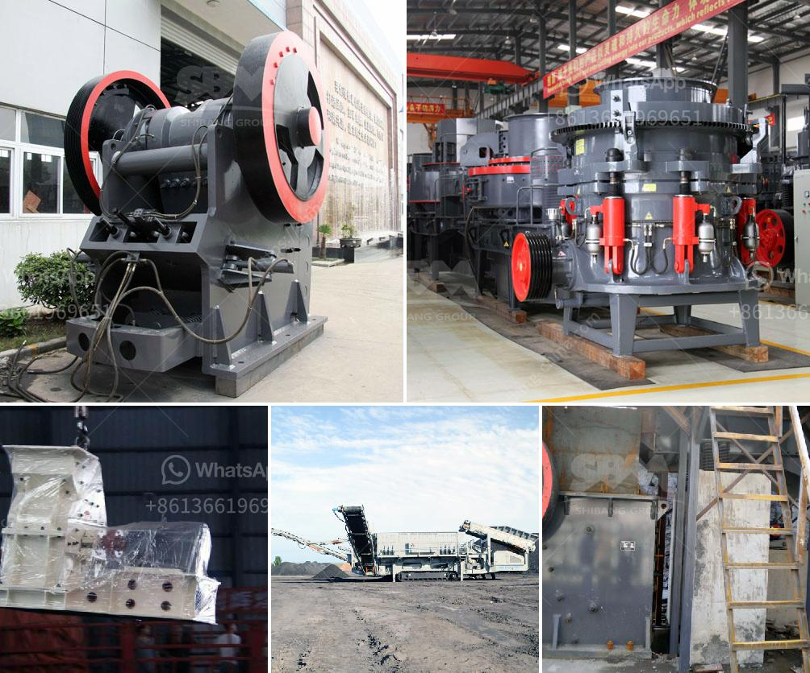

<h3>stone crusher vibrating screen manila</h3>
Manila, the capital of the Philippines, is a bustling city with immense infrastructure and bustling energy. One of the essential components of this infrastructure is the stone crusher vibrating screen, a machine that helps in segregating various sizes of stones into different chunks to be used for various construction purposes. In Manila, where construction activities are always at their peak, these vibrating screens play a crucial role in streamlining the production process.

Stone crushers are heavy-duty machines used in the mining and quarrying industry to crush rocks and stones into smaller pieces for further processing. Vibrating screens, on the other hand, are a vital component of the stone crushing process as they ensure a continuous flow of crushed stones and segregate them according to different sizes.

The stone crusher vibrating screens in Manila are one of the most commonly used equipment in the mining industry. These machines can help in separating different sizes of stones, reducing the overall crushing process, and providing a consistent supply of crushed stones for construction projects. The vibrating screens are designed in such a way that they efficiently separate stones of different sizes, ensuring a uniform output.

The usage of vibrating screens in Manila's stone crushing process has several advantages. Firstly, these screens help in reducing the overall processing time by efficiently segregating stones of different sizes. This ensures a continuous supply of crushed stones for construction purposes, enabling efficient completion of projects without any delay.

Secondly, the vibrating screens also enhance the quality of the crushed stones. By segregating stones of different sizes, the screens help in producing stones that are consistent in size and shape. This is crucial for construction purposes as uniformly sized stones provide a stable base for buildings and infrastructure projects.

Furthermore, stone crusher vibrating screens play a vital role in reducing operational costs. With efficiently segregated stones, the stone crushing process becomes more streamlined, thus requiring less time, labor, and energy. This results in significant cost savings, contributing to the overall profitability of construction projects in Manila.

Additionally, these vibrating screens are also beneficial for the environment. By streamlining the stone crushing process, the use of these screens minimizes energy consumption, reduces unnecessary wastage, and ensures that only the required sizes of stones are produced. This environmentally friendly approach aligns with Manila's commitment to sustainable development and responsible construction practices.

In conclusion, the stone crusher vibrating screens in Manila are indispensable equipment in the construction industry. These machines efficiently segregate stones of different sizes, ensuring a continuous flow of crushed stones for various construction projects. The advantages of using vibrating screens include reduced processing time, improved stone quality, reduced operational costs, and environmental sustainability. As Manila continues to thrive and expand, the stone crusher vibrating screens will continue to play a crucial role in supporting the city's construction activities.
<h3>Contact us</h3><ul><li><strong>Whatsapp:&nbsp;<a href="https://wa.me/8613661969651">+8613661969651</a></strong></li><li><a href="https://swt.shibang-china.com/?git&amp;zhl&amp;stone crusher vibrating screen manila"><strong>Online Service(chat now)</strong></a></li></ul><h3>Related</h3><ul><li><a href='stone crushers kenya.md'>stone crushers kenya</a></li><li><a href='list of concrete products manufacturers in ethiopia.md'>list of concrete products manufacturers in ethiopia</a></li><li><a href='sizing jaw crusher.md'>sizing jaw crusher</a></li><li><a href='pe 400 by 600 single toggle jaw crusher specifications.md'>pe 400 by 600 single toggle jaw crusher specifications</a></li><li><a href='grinding mill cocoa powder plant duyvis.md'>grinding mill cocoa powder plant duyvis</a></li></ul>