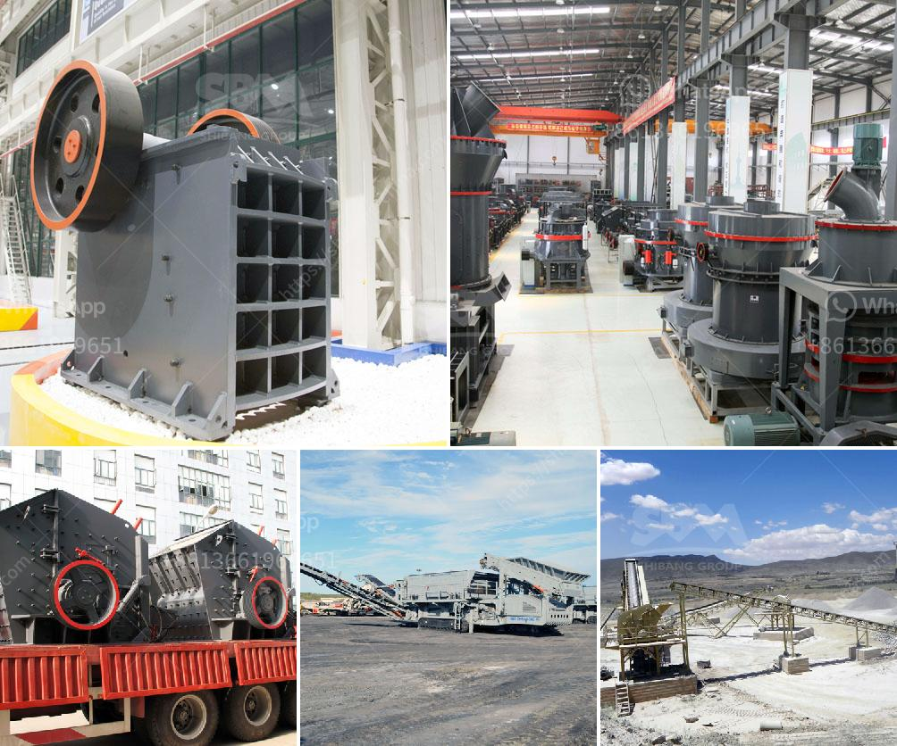

<h3>stone crusherproduction line</h3>
Stone crusher production line, also known as stone crushing screening plant, is mainly composed of vibrating feeder, jaw crusher, impact crusher, cone crusher, vibrating screen, belt conveyor and other equipment, which can be used for crushing various rocks, gravel, river stone, limestone and other materials. The quality of the finished product after crushing completely meets the standard, providing qualified aggregates for the highway, railway, water conservancy and concrete mixing stations.

The stone crusher production line adopts the first-class crushing equipment and equipment produced by Zhongxin Heavy Industry, and takes the advantages of high efficiency, low energy consumption, low operating cost, high degree of automation, convenient maintenance, etc. The stone production line is mainly used in the sand and stone production industry, such as construction industry, water conservancy engineering, metallurgy industry, etc. The production line consists of vibrating feeder, jaw crusher, cone crusher, vibrating screen and belt conveyor. According to specific requirements, we can combine different models to meet various needs.

The stone crusher production line has been successfully applied to the crushing of limestone, basalt, granite, cobblestone and other rocks. The quality of the finished product after crushing has fully met the GB14685-2001 standard, providing qualified aggregate for the highway, railway, water conservancy and concrete mixing stations.

With the rapid development of the economy, infrastructure construction has also accelerated. The demand for sand and gravel aggregates has doubled, and the stone crusher production line has become an effective solution to meet the market demand. Zhongxin Heavy Industry's stone crusher production line has the advantages of high automation, high crushing efficiency, low operating cost, high yield, energy saving and environmental protection. It has been highly praised by customers all over the world and is a cost-effective sand and gravel production line equipment.
<h3>Contact us</h3><ul><li><strong>Whatsapp:&nbsp;<a href="https://wa.me/8613661969651">+8613661969651</a></strong></li><li><a href="https://swt.shibang-china.com/?git&amp;zhl&amp;stone crusherproduction line"><strong>Online Service(chat now)</strong></a></li></ul><h3>Related</h3><ul><li><a href='feldspar grinding machine chennai suppliers.md'>feldspar grinding machine chennai suppliers</a></li><li><a href='gravel crushers for sale in.md'>gravel crushers for sale in</a></li><li><a href='working principle of ball mill pdf.md'>working principle of ball mill pdf</a></li><li><a href='gold ore crushers for sale in india.md'>gold ore crushers for sale in india</a></li><li><a href='quartz powder manufacturing process.md'>quartz powder manufacturing process</a></li></ul>