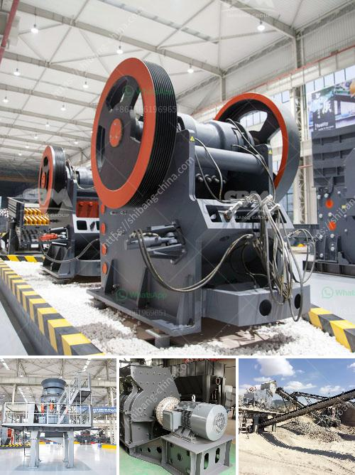

<h3>stone crushers companies in tanzania</h3>
Stone Crushers are essential mining equipment for crushing, grinding, ore dressing and others. 2 types of stone crushers are cone crusher and jaw crusher. The vertical shaft impact crusher is also called sand maker. star trace develop this domestic, international, advanced level efficient crushing equipment combining the actual situation in domestic sand making, and it is based on the “stone hit stone principle and technology. it is widely used in all kinds of hard and brittle materials for medium, fine crushing. Such as, rocks, abrasive, refractory, cement clinker, quartz, iron ore and concrete aggregate and so on, and building sand, building road gravel are the most appropriate. 

For these reasons, among others, stone crushers are used by different industries like mining, construction, cement, healthcare, and chemical industries. Due to the flourishing growth of these industries in Tanzania, there is a huge demand for crusher parts in the market. However, due to the high cost of purchasing these stone crushers, companies in Tanzania are looking for briquette manufacturing companies to market, sell and install these highly productive and versatile machinery across the region. 

Investment choices for stone crushers manufacturing companies have been increasing all over the world since the decade of the 1980s with the rise of the Asian economies. This growth has increased more stone crushers companies clientele. Investing in crusher manufacturing equipment is a high-risk process, especially for some mega-infrastructure projects. Therefore, companies are continuously looking to outsource their crusher production requirements. The demand for crushing machinery is always growing because of the demand for aggregates in various constructions, such as buildings, roads, and railways. 

The stone crushing equipment market is fragmented in nature due to the presence of several major construction & industrial machinery manufacturers across the globe. The typical process flow of stone crushing plant consists of vibrating feeder, primary crusher, secondary crusher, and vibrating screen. The final products of stone crusher with different particle size, such as 0-5mm, 5-10mm, 10-20mm, 20-40mm, and 40-8mm can be used for different purposes such as building construction, landscaping, concrete aggregate for road construction and others. With the rapid development of Tanzania, the demand for stone crushers is increasing year by year, and the investment market threshold is gradually approaching its peak. 

Stone Crushing Plant for sale in Tanzania,Stone Crushing Plant Stone crushers are essential crushing equipment in mining and stone quarry site. In stone quarry, stone crushers are used to crush stones into small particle sale stone crusher used vibrator YouTube

- Feb 26, 2017· Sale and Purchase Website Crusher machine Stone Crusher Cone Crusher Wood Crusher Machine Used Crushers ... ireland, stone crusher is the. It can be used to ... Red Rhino Mini Crusher by snit96 ...

- Aug 3, 2016 Tanzania Aggregate Sand and Gravel Crushing Plant ... Impact Breakers Crusher... VIEW DETAIL
<h3>Contact us</h3><ul><li><strong>Whatsapp:&nbsp;<a href="https://wa.me/8613661969651">+8613661969651</a></strong></li><li><a href="https://swt.shibang-china.com/?git&amp;zhl&amp;stone crushers companies in tanzania"><strong>Online Service(chat now)</strong></a></li></ul><h3>Related</h3><ul><li><a href='manufacturers of mobile crushing plants.md'>manufacturers of mobile crushing plants</a></li><li><a href='hammer mill grinder 10 mm.md'>hammer mill grinder 10 mm</a></li><li><a href='stone crusher plant in turkey.md'>stone crusher plant in turkey</a></li><li><a href='stone crusher rotary screen in karnataka.md'>stone crusher rotary screen in karnataka</a></li><li><a href='chrome ore price in south africa.md'>chrome ore price in south africa</a></li></ul>