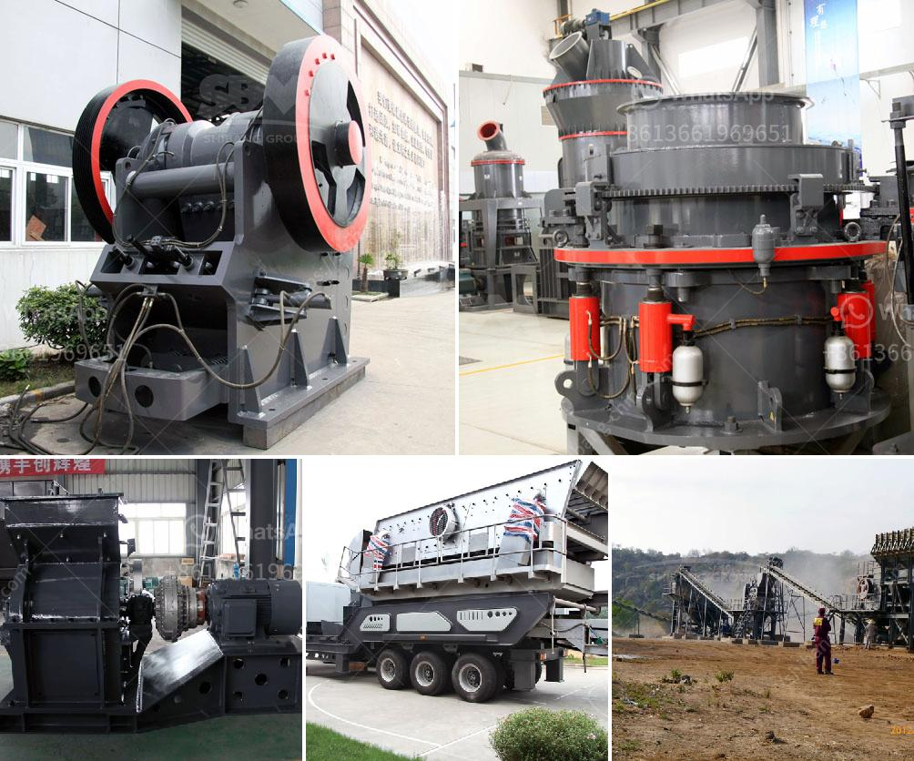

<h3>stone crushers for sale in south africa</h3>
Stone crushers are machines that are used to reduce rocks, stones, and ore into smaller sizes for further processing. They are commonly used in mining, metallurgical, building materials, highways, railways, water conservancy, and chemical industries.

There are various types of stone crushers in South Africa, such as jaw crusher, cone crusher, impact crusher, hammer crusher, and so on. These different types can meet various production needs. It can process materials ranging from 50-500 tons per hour. In addition, different types of stone crushers have different output sizes, which can be adjusted according to the specific requirements of customers.

In recent years, the demand for stone crushers in South Africa has surged due to the rapid development of the mining industry. South Africa is a country with rich mineral resources and is a major producer of platinum group metals, gold, diamonds, ferrous metals, and coal.

In addition to these minerals, there are many other materials that can be processed by stone crushers, such as limestone, dolomite, marble, granite, gypsum, pebble, and quartzite. These materials can be used in various construction projects, such as buildings, roads, bridges, and railways.

When purchasing a stone crusher, it is important to consider factors such as the size, hardness, and moisture content of the raw materials. The size of the input material determines the size of the output of the stone crusher. The hardness of the material affects the wear resistance of the crusher parts. The moisture content of the material affects the efficiency of the crushing process.

There are many stone crusher manufacturers in South Africa. Zhengzhou Great Wall Heavy Industry Machinery Co., Ltd is one of the largest stone crusher manufacturers in the country. In addition to its headquarters in China, Great Wall also has branches in South Africa. Stone crusher sales in South Africa are hot.

The reasons for the price difference of the stone crusher machines produced by Great Wall are mainly related to the following factors:

1. The stone crusher machine price depending on the model and quantity. Different models of stone crusher machines have different prices. Prices are also affected by the power of the motor and whether the machine is equipped with a dust removal device.

2. The sales volume of the manufacturer affects the price of the machine. Large manufacturers have strong comprehensive strength and quality assurance. Therefore, the price will be higher than that of small manufacturers.

3. Market demand and competition also affect the price. If the market demand is high and the competition is intense, the price of stone crusher machines will be correspondingly higher.

In conclusion, the stone crusher machine in south africa is often equipped with different specifications of the motor, which can make the stone crusher machine price in south africa different. In addition to environmental protection, the stone crusher machine in south africa also has automatic lubrication system, which makes the machine work more smoothly and greatly reduces the staff's labor intensity. Stone crushers can be used to crush large stones and rocks into smaller sizes to meet customer requirements for gravel or sand materials. With the development of the mining industry, more and more stone crusher machines are needed for mining, road construction, building materials, and other industries. Mining companies are looking for cheap and efficient stone crushers. South Africa is known as the largest gold miner in the world. We will provide various types of stone crushers for gold mining. If you want to buy stone crusher, please contact us.
<h3>Contact us</h3><ul><li><strong>Whatsapp:&nbsp;<a href="https://wa.me/8613661969651">+8613661969651</a></strong></li><li><a href="https://swt.shibang-china.com/?git&amp;zhl&amp;stone crushers for sale in south africa"><strong>Online Service(chat now)</strong></a></li></ul><h3>Related</h3><ul><li><a href='grinding mill machine.md'>grinding mill machine</a></li><li><a href='small diesel engine jaw crusher.md'>small diesel engine jaw crusher</a></li><li><a href='grinding mill machine kenya.md'>grinding mill machine kenya</a></li><li><a href='south africa jaw crushers.md'>south africa jaw crushers</a></li><li><a href='cement plant in riyadh.md'>cement plant in riyadh</a></li></ul>