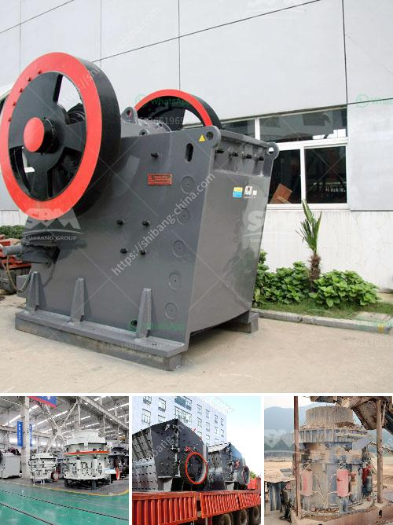

<h3>stone crushers for sale south africa second hand</h3>
Stone crushers for sale in South Africa are used to crush various rocks and stones into smaller size or adjust the form in the next process. These crushers are typically used in the mining industry, construction materials, metallurgy, and chemical industry. It is suitable for all kinds of ores with compressive strength of not more than 320 MPa.

With the widening application of crushing equipment, stone crushers for sale South Africa second hand are increasingly popular in the market. There are many types of crushers available such as jaw crusher, impact crusher, cone crusher, hammer crusher, vertical shaft impact crusher, and so on. These stone crushers are designed to crush different types of materials, from soft and medium hardness to extremely hard materials.

Second-hand stone crushers have a strong market in South Africa. Many stone crushers sold in South Africa are imported from other countries. However, there is a local way to get the best price for the equipment. When the equipment is imported, it will not be priced domestically. The price will depend on the supplier's valuation and exchange rate fluctuations. Therefore, the price of second-hand crushers is very high. On the other hand, the second-hand stone crusher has been modified to make it more efficient and cost-effective. For example, replacing a new eccentric shaft of a second-hand crusher can improve the overall performance of the crusher.

Therefore, in the era of building a "green and sustainable society," recycling of construction waste becomes the most popular trend. The second-hand stone crusher for sale is relatively cheaper on the market. Compared with new crushers, second-hand crushers are more cost-effective and can effectively reduce the wear and tear of equipment, which extends the service life of the equipment.

In conclusion, stone crushers for sale South Africa second hand covers a wide range of models and sizes, which can meet the requirements of different users. Only when the equipment is operated in accordance with the instructions, can it effectively reduce the failure rate, improve the efficiency, and increase the output.
<h3>Contact us</h3><ul><li><strong>Whatsapp:&nbsp;<a href="https://wa.me/8613661969651">+8613661969651</a></strong></li><li><a href="https://swt.shibang-china.com/?git&amp;zhl&amp;stone crushers for sale south africa second hand"><strong>Online Service(chat now)</strong></a></li></ul><h3>Related</h3><ul><li><a href='course sand manufacturers in india.md'>course sand manufacturers in india</a></li><li><a href='mini cement plant for sale 500tpd.md'>mini cement plant for sale 500tpd</a></li><li><a href='chinese diesel propelled stone crushers for sale.md'>chinese diesel propelled stone crushers for sale</a></li><li><a href='lancaster building supply in vryheid.md'>lancaster building supply in vryheid</a></li><li><a href='gold wash plant for sale in the usa.md'>gold wash plant for sale in the usa</a></li></ul>