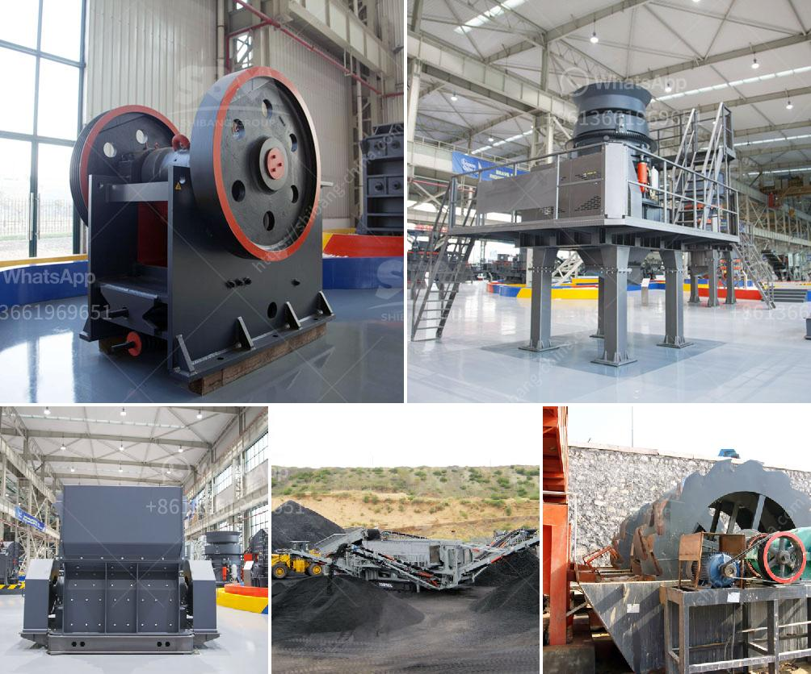

<h3>stone crushers kenya</h3>
Stone crushing is a tough job, but one that can be immensely rewarding for those who excel in it. With the right equipment and techniques, a careful balance of excavation and crushing processes can bring about desired outcomes. However, this requires a substantial investment in machinery, equipment, and manpower. In Kenya, stone crushers are essential for effective crushing of stones to produce aggregates for construction purposes. This industry plays a crucial role in the national economy, as it ensures that raw materials required for infrastructure development are readily available.

The stone crushing industry in Kenya is a significant contributor to the country’s economy. The stones are broken down to granite stone material. The granite stone is used in foundations, roads, bridges, and other construction projects. So, how does a stone crusher work? A stone crusher works by reducing large rocks into smaller pieces. It applies mechanical force through the use of forceps, jaw crushers, hydraulic cone crushers, roll crushers, and impact crushers. Stone crushers are widely used in the mining, construction, and building material industries.

Stone crushing machines, which are currently being used in Kenya, include jaw crushers, counter-hammer crushers, conical crushers, impact crushers, and hammer crushers. The patterns of the jaws of the stones crusher are desirable for the stones’ size application. A stone crusher should have a maximum feed size of about 0.95 times the opening width, which is normally enough to ensure that the stones are loaded into the stone crushers uniformly. The crushing material is relatively large, which can lead to slippage and other problems during the crushing process. To avoid these issues, the operators should always monitor the crushing process closely and adjust the stone crusher settings accordingly.

The stone crushing business in Kenya is a small scale venture for those with limited capital and experience. Most stone crushers are makeshift operations, as they lack the necessary licenses and permits to legally operate. However, they still play a crucial role in supplying crushed stones for the construction of buildings and roads. These informal stone crushers have become a vital source of income for many marginalized individuals, providing them with the means to support their families and improve their living conditions.

Stone crushers in Kenya face numerous challenges, including poor infrastructure, lack of modern equipment, inadequate training, and lack of capital. However, despite these hurdles, the industry continues to thrive in many parts of the country. With the right support, stone crushers can contribute significantly to the country’s economic development.

To ensure the success of the stone crushing industry in Kenya, government agencies and other stakeholders should focus on providing better infrastructure, such as roads and highways, to facilitate the transportation of crushed stone. Furthermore, it is crucial to provide training programs for stone crusher operators to improve their knowledge and skills on the proper use and maintenance of stone crushers. Additionally, financial institutions should develop loan products specifically tailored to the needs of stone crusher operators, allowing them to access much-needed capital for investment in modern equipment and machinery.

In conclusion, stone crushers in Kenya are a crucial part of the construction industry and the economy at large. They offer opportunities for businesses, entrepreneurs, and individuals to contribute to the country's economic growth while improving their own livelihoods. Therefore, it is essential for stakeholders to provide the necessary support to ensure the success and sustainability of the stone crushing industry in Kenya.
<h3>Contact us</h3><ul><li><strong>Whatsapp:&nbsp;<a href="https://wa.me/8613661969651">+8613661969651</a></strong></li><li><a href="https://swt.shibang-china.com/?git&amp;zhl&amp;stone crushers kenya"><strong>Online Service(chat now)</strong></a></li></ul><h3>Related</h3><ul><li><a href='portable concrete crushers.md'>portable concrete crushers</a></li><li><a href='quarry equipment manufacturer.md'>quarry equipment manufacturer</a></li><li><a href='vertical mill size.md'>vertical mill size</a></li><li><a href='crushers for granite aggregate.md'>crushers for granite aggregate</a></li><li><a href='equipment used in quarry crusher.md'>equipment used in quarry crusher</a></li></ul>