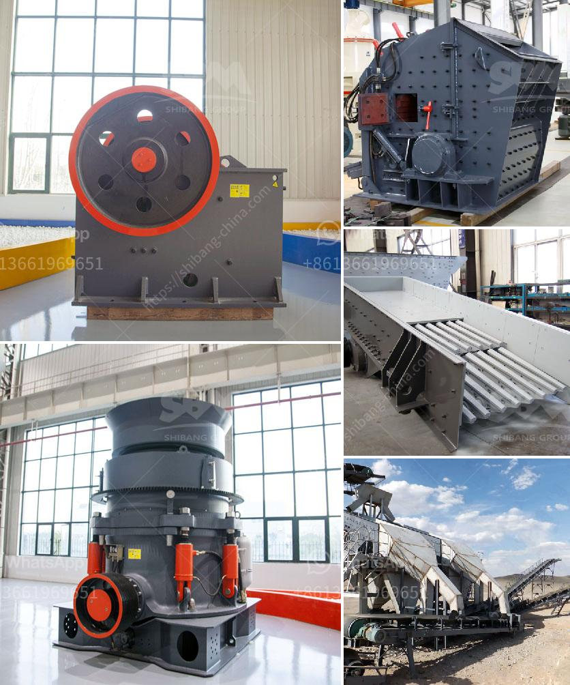

<h3>stone crushers price</h3>
Stone crushers are one of the most commonly used equipment in the mining industry. They are used to break down large pieces of stones into smaller pieces, so that they can be transported easily. The stone crushers come with a variety of specifications, and their price ranges from $10,000 to $1,000,000. With so many options available, how can we determine the best price for a stone crusher?

The price of a stone crusher depends on several factors. First, the brand reputation of the manufacturer plays a crucial role. A well-known and reputable brand will charge a premium price for its products due to the trust and quality associated with it. On the other hand, lesser-known or newer brands might offer their products at a lower price to attract customers.

Secondly, the specifications of the stone crusher impact its price. Different stone crushers have different capacities, feeding sizes, and output sizes. High-capacity and heavy-duty stone crushers tend to have higher prices, as they are designed to handle large quantities of materials. Additionally, stone crushers with adjustable output sizes are more expensive compared to those with fixed output sizes.

Thirdly, the availability and demand of stone crushers in the market also affect their price. If there are many stone crushers available in the market, the competition will drive down the prices. Alternatively, a stone crusher in high demand may command a higher price.

Lastly, the location of the manufacturer and the transportation costs also impact the overall price of a stone crusher. Manufacturers located in areas with high labor and operating costs may price their products higher to cover these expenses. Similarly, the shipping costs incurred due to long distances can add to the final price.

In conclusion, determining the best price for a stone crusher depends on various factors such as brand reputation, specifications, demand, and location. Buyers should consider these factors and find the perfect balance between affordability and quality. Investing in a stone crusher can provide immense value for money by enabling efficient and cost-effective crushing of stones for various applications in the mining industry.
<h3>Contact us</h3><ul><li><strong>Whatsapp:&nbsp;<a href="https://wa.me/8613661969651">+8613661969651</a></strong></li><li><a href="https://swt.shibang-china.com/?git&amp;zhl&amp;stone crushers price"><strong>Online Service(chat now)</strong></a></li></ul><h3>Related</h3><ul><li><a href='jaw crusher for hire south africa for limestone.md'>jaw crusher for hire south africa for limestone</a></li><li><a href='industrial jaw crushers.md'>industrial jaw crushers</a></li><li><a href='jaw crusher 200 tonnes per hour.md'>jaw crusher 200 tonnes per hour</a></li><li><a href='german hammer mill ceramic.md'>german hammer mill ceramic</a></li><li><a href='metals alloys for ball mill.md'>metals alloys for ball mill</a></li></ul>