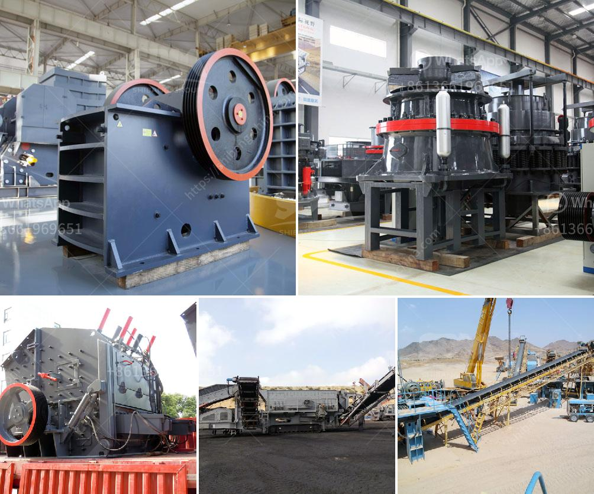

<h3>stone crushers suppliers</h3>
Stone crushers are machines that break down large rocks into smaller pieces. The smaller pieces are typically used for gravel and construction purposes. These machines are found in various sizes and types, including stationary and mobile units. Stone crushers can be classified into primary crushing, secondary crushing, and tertiary crushing machineries.

Suppliers of stone crushers are the necessary components in a crushing plant. These are responsible for processing the raw materials into the desired sizes. As per the needs of the construction industry, there are different types of stone crushers available in the market. The selection of these crushers depends on several factors, such as the type of stone to be crushed, the required output, the machine's durability, and the budget.

Stone crushers suppliers play a crucial role in the construction industry. They provide the necessary equipment needed for rock and stone crushing operations. These crushers have different capacities and output sizes, enabling professionals to handle different construction projects efficiently. Some suppliers specialize in specific types of crushers, while others offer a wide range of options.

When selecting stone crushers suppliers, it is important to consider their reputation and experience in the industry. Reputable suppliers have a proven track record of delivering high-quality machinery that meets industry standards. They can provide valuable advice and guidance on the suitable crushers for specific projects. Additionally, experienced suppliers are reliable and can provide prompt customer support and after-sales services.

The quality of the crushers is another essential factor to consider. High-quality stone crushers provide efficient and reliable crushing operations. They are made from durable materials that can withstand heavy-duty usage. Suppliers offering top-notch crushers often conduct rigorous quality checks to ensure that their products are of superior quality.

Cost is another aspect to consider when selecting stone crushers suppliers. The prices vary depending on the capacity, size, and features of the crushers. It is important to compare prices from different suppliers and choose one that fits within the allotted budget. However, it is crucial not to compromise on quality to save costs. Investing in high-quality crushers initially may result in long-term savings due to their durability and efficiency.

Stone crushers suppliers also offer additional services, such as installation, maintenance, and repairs. It is advisable to choose suppliers who provide comprehensive after-sales services. This ensures that any issues or problems encountered with the crushers can be resolved promptly. Additionally, regular maintenance services help prolong the lifespan of the crushers, ensuring consistent performance.

In conclusion, stone crushers suppliers are essential for the construction industry. They provide high-quality crushers that break down large rocks into smaller pieces for various applications. When selecting suppliers, it is crucial to consider their reputation, experience, and the quality of their products. Comparing prices and choosing a supplier that provides comprehensive after-sales services is also important. By making informed decisions, professionals in the construction industry can ensure efficient crushing operations for their projects.
<h3>Contact us</h3><ul><li><strong>Whatsapp:&nbsp;<a href="https://wa.me/8613661969651">+8613661969651</a></strong></li><li><a href="https://swt.shibang-china.com/?git&amp;zhl&amp;stone crushers suppliers"><strong>Online Service(chat now)</strong></a></li></ul><h3>Related</h3><ul><li><a href='difference between vsi and sand making machine.md'>difference between vsi and sand making machine</a></li><li><a href='ball mills used in peru.md'>ball mills used in peru</a></li><li><a href='powder grinding mill machine equipment.md'>powder grinding mill machine equipment</a></li><li><a href='small impact crusher.md'>small impact crusher</a></li><li><a href='portable diamond washing plant.md'>portable diamond washing plant</a></li></ul>