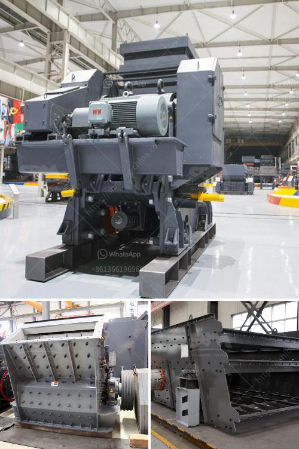

<h3>stone crushing for sale</h3>
Stone crushing is the process of reducing large stones into smaller ones, depending on the requirements. Crushing turns a valuable resource into a commodity that is used by many industries for a variety of purposes, such as construction, road building, and agriculture.

Crushers are machines used to mechanically break down the stones into smaller pieces. Crushers come in various sizes and types, including jaw crushers, impact crushers, and cone crushers. These machines are portable and can be easily transported along with the stone crushing plant for sale. This flexibility allows contractors to use the machine wherever they need it to be, whether it is a remote site or a busy construction area.

Stone crushing plants for sale are suitable for various construction applications. For instance, in the field of highway construction, stone crushers are used to process medium-hard stones into smaller pieces for different construction purposes. In addition, stone crushing plants provide aggregate material for other construction projects, such as cement production plants, highways, railway, and bridges. The cost of transportation is reduced, making the process more efficient and economical.

Moreover, stone crushing machines have various optional accessories to increase their efficiency. For example, jaw crushers can be equipped with feeders to ensure continuous and uniform feeding of the stones. Screens can also be added to the crushing process to separate the desired size of the crushed stones. These accessories not only improve the crushing process but also enhance the overall performance of the stone crushing plant.

Stone crushing machines are available in different capacities to meet the requirements of different construction projects. Whether it is a small-scale project or a large-scale one, there is a stone crusher for sale that can increase productivity, efficiency, and profitability. Stone crushing plant for sale is also highly flexible and can be customized according to specific needs of different customers without compromising on performance or durability.

Notably, stone crushing machines have a low environmental impact. This is because they minimize dust and noise pollution during the crushing process. Furthermore, they use less energy compared to other crushing machines. This contributes to reducing the carbon footprint and making stone crushing plants for sale a sustainable solution for the construction industry.

In conclusion, stone crushing machines for sale offer a valuable resource for various construction applications. They provide a cost-effective solution for contractors to process stones into smaller pieces, improving productivity and efficiency. Stone crushing plants for sale are also flexible, customizable, and environmentally friendly. With a wide range of optional accessories and capacities available, stone crushing machines cater to the specific requirements of different construction projects, making them an essential investment for the industry.
<h3>Contact us</h3><ul><li><strong>Whatsapp:&nbsp;<a href="https://wa.me/8613661969651">+8613661969651</a></strong></li><li><a href="https://swt.shibang-china.com/?git&amp;zhl&amp;stone crushing for sale"><strong>Online Service(chat now)</strong></a></li></ul><h3>Related</h3><ul><li><a href='qurry crusher plant capacity.md'>qurry crusher plant capacity</a></li><li><a href='used jaw crushers canada.md'>used jaw crushers canada</a></li><li><a href='cement plant in turkey.md'>cement plant in turkey</a></li><li><a href='iron ore processing machine for sale.md'>iron ore processing machine for sale</a></li><li><a href='manufacturers of mobile crushing plants.md'>manufacturers of mobile crushing plants</a></li></ul>