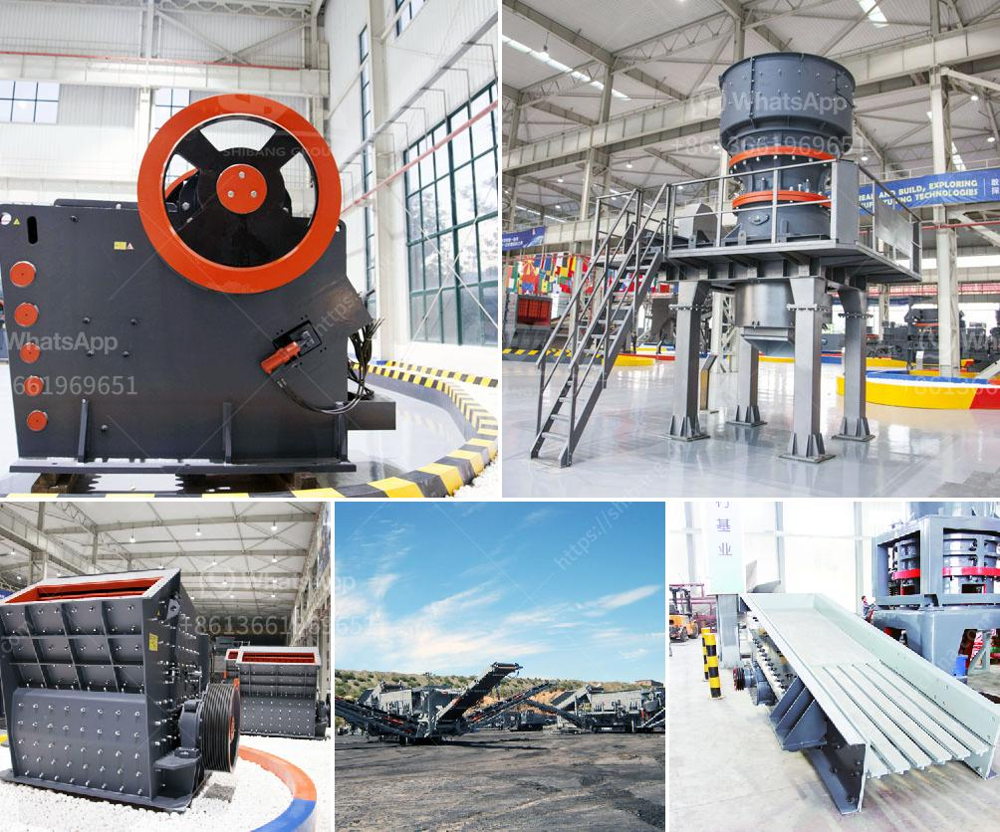

<h3>stone crushing machine in china</h3>
Stone crushing machine plays an important role in the mining industry and it plays a vital role in the construction industry. China’s rapid economic development is inseparable from the development of the mining industry. In recent years, China's mining machinery industry has developed rapidly and the country has gradually increased investment in scientific research. Many manufacturers of mining machinery in China are actively promoting technological innovation and actively improving the technological content of their products.

Stone crushing machines are quite popular in the mining industry. Every year, there are a variety of stone crushers being produced in China. The size of the crushed stone varies depending upon the requirement of the construction activities. It is important to choose the right kind of stone crusher because there are different capacities and sizes available.

To further improve the quality of the Chinese stone crushers, manufacturers have put more efforts into research and development. The stone crushing machines produced in China are increasingly favored by customers. The technical level of many crushing equipment manufacturers, and the comprehensive strength of the Chinese crushing equipment industry, are also increasing. In particular, the introduction of advanced technology from abroad and the development of new materials have greatly advanced the development of China's stone crushing machines.

The stone crushing machines in China are generally equipped with several crushing machines and a vibrating feeder. In order to make the crushing process more efficient, all the equipment of the production line is connected by a belt conveyor. The jaw crusher is the first crushing equipment in the production line, and it is the most commonly used crushing machine. In recent years, the composite jaw crusher has made great progress.

In addition to the jaw crusher, there are also counterattack crushers, impact crushers, cone crushers, etc. With the continuous progress of technology, various types of stone crushing machines have been introduced to the market. In addition to the increasing number of stone crushing machines, the performance of these machines is also constantly improving, making them more suitable for various construction needs.

The stone crushing machines produced in China are sold well both at home and abroad. For example, there are many customers from Saudi Arabia, Sri Lanka, Dubai, Vietnam, Philippines, India, and other countries who are interested in stone crushing machines from China. The quality of the stone crushing machines produced in China is guaranteed, and the price is relatively low, making it a popular choice in the market.

In conclusion, stone crushing machines in China have a good development trend. With the continuous improvement of technical level and comprehensive strength of Chinese mining machinery manufacturers, China's stone crushing machines have a broad market prospect both at home and abroad. China's stone crushing machines are preferred by customers with their excellent performance, reasonable price, and comprehensive service, making China a leading manufacturer in the global mining machinery industry.
<h3>Contact us</h3><ul><li><strong>Whatsapp:&nbsp;<a href="https://wa.me/8613661969651">+8613661969651</a></strong></li><li><a href="https://swt.shibang-china.com/?git&amp;zhl&amp;stone crushing machine in china"><strong>Online Service(chat now)</strong></a></li></ul><h3>Related</h3><ul><li><a href='rotary kiln untuk pengeringan batu kapur kapur.md'>rotary kiln untuk pengeringan batu kapur kapur</a></li><li><a href='mineral processing equipment.md'>mineral processing equipment</a></li><li><a href='marble crusher supplier.md'>marble crusher supplier</a></li><li><a href='limestone processing plant price list.md'>limestone processing plant price list</a></li><li><a href='companies of panama conveyor belts.md'>companies of panama conveyor belts</a></li></ul>