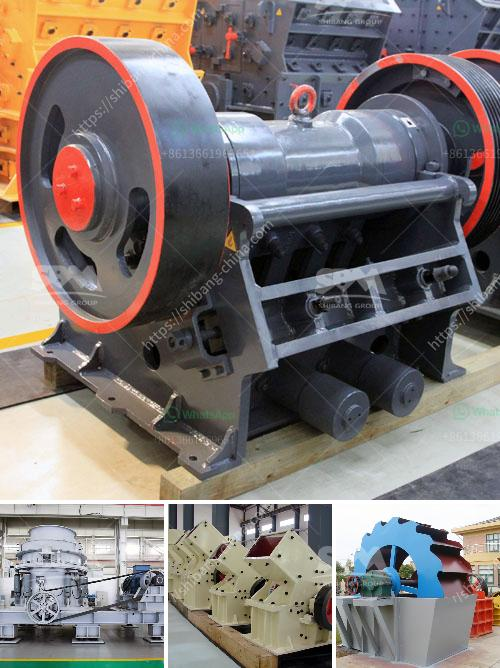

<h3>stone crushing machine manufacturer</h3>
Stone crushing machines are used in a wide range of industries, including mining, construction, quarrying, and recycling. These machines are capable of crushing hard and soft rocks into smaller pieces. The crushed material is typically used for various applications, such as building materials, road construction, and railway ballast.

The stone crushing machine manufacturer delivers high-quality machines and delivers on time. They also provide excellent customer service, making customers satisfied with their products. The machine is designed to be durable and wear-resistant in order to withstand the toughest challenges.

Stone crushing machines are used in various mines, quarries, and building materials projects. They are suitable for crushing various types of ores and rocks, ranging from limestone to basalt and beyond. The crushing machine adopts advanced hydraulic technology to ensure smooth and efficient operation.

In addition, the stone crushing machine is highly automated and requires less maintenance to reduce downtime. It is equipped with advanced control systems to ensure precise and efficient crushing processes. The machine can be operated remotely, further enhancing its ease of operation and reducing operator fatigue.

The stone crushing machine manufacturer has advanced production technology and strict quality management systems. They use high-quality raw materials and components to ensure the machines' durability and reliability. Each machine undergoes comprehensive testing before it is delivered to the customer, ensuring its high performance and long service life.

Overall, the stone crushing machine manufacturer provides reliable machines and excellent customer service. Their products are widely used in various industries and have helped many businesses achieve their production goals. Whether it is a large-scale mining project or a small construction site, the stone crushing machine is a vital piece of machinery that can help businesses thrive.
<h3>Contact us</h3><ul><li><strong>Whatsapp:&nbsp;<a href="https://wa.me/8613661969651">+8613661969651</a></strong></li><li><a href="https://swt.shibang-china.com/?git&amp;zhl&amp;stone crushing machine manufacturer"><strong>Online Service(chat now)</strong></a></li></ul><h3>Related</h3><ul><li><a href='coal crusher machine rental price.md'>coal crusher machine rental price</a></li><li><a href='costs of calcium carbonate making machinery in japan.md'>costs of calcium carbonate making machinery in japan</a></li><li><a href='rock crusher from china.md'>rock crusher from china</a></li><li><a href='desain hammer mill dengan pelat rotor pdf.md'>desain hammer mill dengan pelat rotor pdf</a></li><li><a href='calcium carbonate processing plant cost.md'>calcium carbonate processing plant cost</a></li></ul>