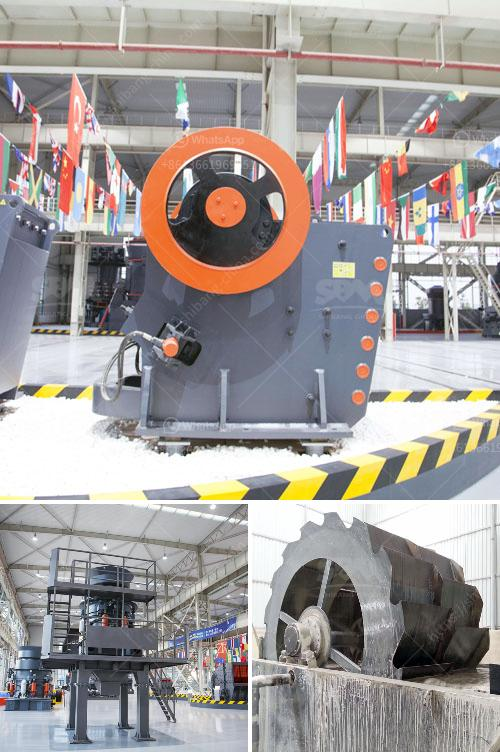

<h3>stone crushing machine zimbabwe</h3>
Stone crushing machines have gained significant popularity in Zimbabwe. Today, stone crushing machines have produced significant results in terms of economy, infrastructure, and manpower since it is an industry that employs thousands of people. Around seven years ago, the industry was limited to the extraction of rocks and stones for construction purposes but now we see many crushers producing crushed stones for road and building materials. This article will explore the benefits that the stone crushing machine industry brings to Zimbabwe.

One of the biggest advantages of the stone crushing machine industry is its contribution to the economy in Zimbabwe. The extraction of minerals such as coal, diamond, and gold has long been a crucial economic activity. However, with the advent of stone crushing machines, mining activities in Zimbabwe have become less labor-intensive and more efficient. The use of crushing machines allows mines to extract materials more easily, thus reducing the need for manual labor and increasing productivity. As a result, the industry has contributed significantly to the national GDP, providing a stable source of income for the government.

In addition to its economic benefits, the stone crushing machine industry also plays a vital role in infrastructure development in Zimbabwe. Crushing machines are commonly used to produce aggregates used for construction purposes, such as crushed stones, sand, and gravel. These materials are essential for the construction of roads, bridges, buildings, and other infrastructure projects. The availability of affordable and high-quality construction materials has accelerated infrastructure development, making Zimbabwe more attractive for investors and improving the overall living standards of its citizens.

Furthermore, the stone crushing machine industry has created numerous job opportunities for Zimbabweans, both directly and indirectly. The industry employs a large number of skilled and unskilled workers, creating a ripple effect on related sectors such as transportation, logistics, and manufacturing. This has helped reduce the unemployment rate in Zimbabwe, contributing to a more stable and prosperous society. Moreover, the industry provides entrepreneurial opportunities for individuals who wish to start small-scale crushing businesses, thereby promoting self-employment and economic empowerment.

Despite the positive impact of the stone crushing machine industry, there are also concerns that need to be addressed. One major issue is environmental degradation caused by dust and noise pollution. Crushing machines generate dust particles that can have adverse effects on human health as well as the surrounding ecosystem. To mitigate these environmental impacts, strict regulations and policies need to be in place and adhered to by industry operators. Additionally, efforts should be made to minimize noise pollution by implementing noise reduction technologies or locating crushing plants away from residential areas.

In conclusion, the stone crushing machine industry has brought immense benefits to Zimbabwe in terms of economy, infrastructure, and employment opportunities. While there are challenges that need to be addressed, the industry has the potential to continue contributing significantly to the nation's development. It is crucial for stakeholders, including the government, industry players, and environmental organizations, to work together to ensure that the industry progresses sustainably and responsibly.
<h3>Contact us</h3><ul><li><strong>Whatsapp:&nbsp;<a href="https://wa.me/8613661969651">+8613661969651</a></strong></li><li><a href="https://swt.shibang-china.com/?git&amp;zhl&amp;stone crushing machine zimbabwe"><strong>Online Service(chat now)</strong></a></li></ul><h3>Related</h3><ul><li><a href='price of grinding mills in kenya.md'>price of grinding mills in kenya</a></li><li><a href='china cone crushers.md'>china cone crushers</a></li><li><a href='calcium carbonate ball mill process.md'>calcium carbonate ball mill process</a></li><li><a href='price for sand machine.md'>price for sand machine</a></li><li><a href='50tpd slag cement grinding unit cost.md'>50tpd slag cement grinding unit cost</a></li></ul>