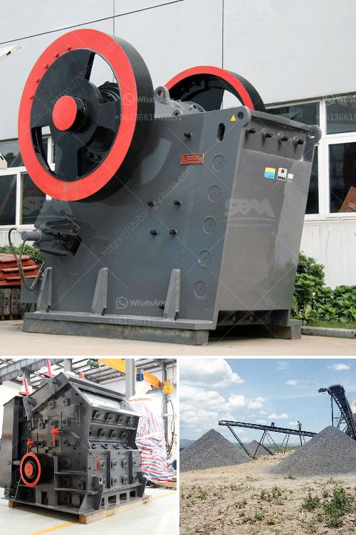

<h3>stone crushing machines for sale in philippines</h3>
Stone crushing machine is used to crush large-sized rocks into fragments by the ways of extruding, splitting, bending, impacting and rolling. Commonly used stone crushing machines are stone jaw crusher, stone cone crusher, hammer stone crusher, roll stone crusher and stone impact crusher, etc. Stone crushing machine is used to crush large-sized rocks into fragments by the ways of extruding, splitting, bending, impacting and rolling. Commonly used stone crushing machines are stone jaw crusher, stone cone crusher, hammer stone crusher, roll stone crusher and stone impact crusher, etc.

Stone Crusher Machine Philippines is mainly used to produce sand and gravel aggregate. It can handle different types of materials, such as pebble, iron ore, basal diabase, limestone, slag, granite, etc. Latest price of crushers. Installation and maintenance. Parts of original factory.

The stone crushing machine used for crushing granite has been popularly sold in stone crushers under the brand name of FTM Machinery. FTM Machinery is a manufacturer and supplier of mining machinery and equipment. It mainly deals with crushing and screening machines. The machine is larger than any other crushers from the past, so it saves more time and energy. The movable jaw assembly is made of high-quality steel castings and alloy forgings. The process is compact, the energy consumption is low, and it can withstand a strong impact. It is used as the first crushing equipment for various ore materials.

The stone crushing machine is manufactured by using quality raw materials and advanced technology. It is widely used in various fields, such as mining, construction, road construction, and chemical industry. It is suitable for crushing high-hardness materials such as iron ore, copper ore, limestone, quartz, granite, etc. Cone crusher has excellent performance and advanced crushing principle. It has wide applications and can crush various ores and rocks with the required hardness.

Mobile crusher is a mobile crushing station, the main equipment is jaw crusher, cone crusher, impact crusher, etc. The mobile crushing station is mainly used for the crushing operation of materials. It is widely used in metallurgy, chemical industry, building materials, hydropower and other materials that need to be relocated, especially for the operation of mobile materials such as highways, railways, hydropower projects, etc. Users can adopt various configurations according to the types of raw materials, the size and the finished product requirements of different materials.

Choosing a suitable stone crushing machine is the key to determine whether the whole production line will run smoothly. The common stone crushers are mainly jaw crusher, mobile crusher, impact crusher, impact crusher, hammer crusher, cone crusher, etc. They all have their own characteristics. If the customer has a certain understanding of the crushing equipment, it is a targeted purchase, saving time and effort. .

The stone crushing machine has a simple structure, reliable work and low operating cost. It is a famous manufacturer of crushing and screening equipment and provides series stone crusher and crushing equipment for customers, which includes hydraulic cone crusher, jaw crusher, impact crusher, vertical shaft impact crusher,vibrating screen and mobile crushing plant. We offer not only products with good quality and competitive price, but also top service and solution based on requirements of users.
<h3>Contact us</h3><ul><li><strong>Whatsapp:&nbsp;<a href="https://wa.me/8613661969651">+8613661969651</a></strong></li><li><a href="https://swt.shibang-china.com/?git&amp;zhl&amp;stone crushing machines for sale in philippines"><strong>Online Service(chat now)</strong></a></li></ul><h3>Related</h3><ul><li><a href='hammer mill for oregano.md'>hammer mill for oregano</a></li><li><a href='caterpillar jaw crusher for sale ebay.md'>caterpillar jaw crusher for sale ebay</a></li><li><a href='crusher stone crusher 10x 21 america.md'>crusher stone crusher 10x 21 america</a></li><li><a href='jaw crusher animation.md'>jaw crusher animation</a></li><li><a href='stone crusher plant hire gold in zimbabwe.md'>stone crusher plant hire gold in zimbabwe</a></li></ul>