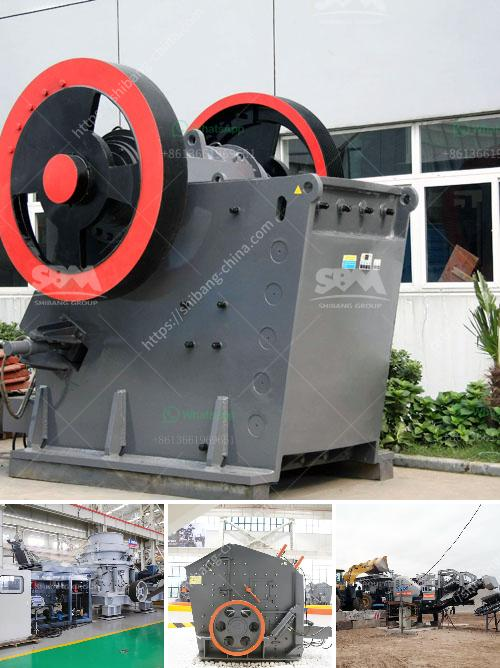

<h3>stone crushing machines in canada</h3>
Stone crushing machines are widely used in the mining industry. It is a machine that uses a high-speed rotating cutter blade to pulverize materials into small and uniform feedstock. With the development of new technologies, these machines have greatly improved in terms of efficiency and energy consumption, and have become essential equipment in the mining and construction industries.

Canada is a rich resource country with huge potential for exploration and mining. The stone crushing machines produced by our company have been widely used in the global mining and construction industry for decades, and have been highly recognized and trusted by customers. The sales network has been continuously expanded, and the products have been exported to many countries and regions around the world, including Canada.

The stone crushing machines in Canada are mainly used for crushing granite, limestone, marble, and other hard materials. It has the advantages of high crushing efficiency, large production capacity, and low energy consumption. The crushing equipment in Canada has played a significant role in the economic development of the country.

In recent years, with the continuous advancement of technology, the stone crushing machines in Canada have been continuously optimized and developed. The machines are equipped with advanced control systems, which can automatically adjust the size of the discharge opening and the corresponding crushing force according to different materials. This ensures the uniformity of the crushed materials and improves the crushing efficiency.

Additionally, the stone crushing machines in Canada are also environmentally friendly and energy-saving. The use of advanced technology and new materials has greatly reduced the noise and dust emissions during operation, making it more comfortable and safer for operators. At the same time, it also reduces energy consumption and operating costs.

In conclusion, stone crushing machines in Canada play a vital role in the mining and construction industries. With their high efficiency, energy-saving features, and environmental friendliness, these machines have become an indispensable tool for the economic development of Canada. As technology continues to advance, we can expect further improvements in stone crushing machines, making them even more efficient and reliable.
<h3>Contact us</h3><ul><li><strong>Whatsapp:&nbsp;<a href="https://wa.me/8613661969651">+8613661969651</a></strong></li><li><a href="https://swt.shibang-china.com/?git&amp;zhl&amp;stone crushing machines in canada"><strong>Online Service(chat now)</strong></a></li></ul><h3>Related</h3><ul><li><a href='jaw crusher machine construction diagram.md'>jaw crusher machine construction diagram</a></li><li><a href='crushers for granite aggregate.md'>crushers for granite aggregate</a></li><li><a href='stone crusher sample business plan.md'>stone crusher sample business plan</a></li><li><a href='used stone crushers in south korea.md'>used stone crushers in south korea</a></li><li><a href='crusher and screening plant.md'>crusher and screening plant</a></li></ul>