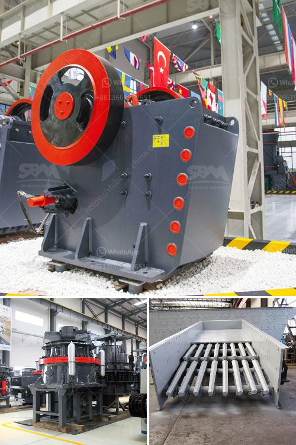

<h3>stone crushing plant for sale in pakistan</h3>
Stone crushing plant is a versatile and efficient machine that is widely used in various industries. It is designed to crush stones of all types and sizes, both large and small. The stone crushing plant in Pakistan is capable of crushing various types of stones, such as limestone, granite, basalt, river stone, marble, etc. The stone crushing plant for sale in Pakistan is easy to operate, reliable in performance, and offers high productivity and low operating cost.

The stone crushing plant can be used in various applications, such as stone mining, building materials, highway, railway, construction waste recycling, and many other industries. The stone crushing plant is suitable for crushing and shaping soft or medium-hard or extremely hard materials. It is widely used in various fields, such as cement, refractories, electric power, metallurgy, building materials, and chemical industries.

The stone crushing plant for sale in Pakistan has been designed with great care, considering the needs of customers. In order to meet customer's unique requirements, the stone crushing plant can be customized in accordance with production requirements. You can choose different types of crushers, such as jaw crusher, impact crusher, cone crusher or a combination of these crushers. The professional team at the stone crushing plant is skilled in designing, manufacturing, and installing a variety of equipment to provide customers with an efficient and cost-effective crushing solution.

The stone crushing plant in Pakistan consists of a vibrating feeder, jaw crusher, impact crusher, vibrating screen, belt conveyor, electric control panel, etc. The stone crushing plant is designed to crush and break different types of stones into smaller pieces of size by accessing the cavity. The stone crushing plant has versatile application such as iron ore crushing plant, gold ore crusher plant, bauxite crushing plant, copper beneficial plant, nickel mining plant, manganese crushing plant, limestone crushing plant, feldspar crushing plant and so on. This crushing plant is widely used as sand making line, rock crushing line, stone crushing plant, and ore dressing line etc.

The stone crushing plant is easy to operate, so it is widely used in the construction industry. The stone crushing plant has large crushing ratio, high production efficiency, and low operating cost. It also has high flexibility, reliable performance, and easy maintenance. In addition, the stone crushing plant for sale in Pakistan can also produce materials suitable for specific end products, such as artificial sand making, stone shaping, and other construction materials.

In conclusion, the stone crushing plant for sale in Pakistan has been perfectly designed with great care to ensure that there is no compromise in quality. The plant is capable of crushing a wide range of stones so that any type of requirement can be fulfilled with ease. With its efficient operation, low operating cost, and high productivity, the stone crushing plant is a profitable investment for any business in Pakistan.
<h3>Contact us</h3><ul><li><strong>Whatsapp:&nbsp;<a href="https://wa.me/8613661969651">+8613661969651</a></strong></li><li><a href="https://swt.shibang-china.com/?git&amp;zhl&amp;stone crushing plant for sale in pakistan"><strong>Online Service(chat now)</strong></a></li></ul><h3>Related</h3><ul><li><a href='stone crusher philippines.md'>stone crusher philippines</a></li><li><a href='advantages and disadvantages of ball mill grinding.md'>advantages and disadvantages of ball mill grinding</a></li><li><a href='coal crushing machine in east rand.md'>coal crushing machine in east rand</a></li><li><a href='blue metal crusher product machine price coimbatore.md'>blue metal crusher product machine price coimbatore</a></li><li><a href='hammer mill grinder 10 mm.md'>hammer mill grinder 10 mm</a></li></ul>