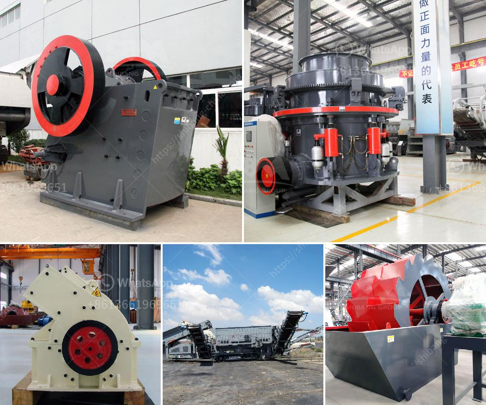

<h3>stone crushing plant in saudi</h3>
Stone crushing plant is the mining industry and construction industry indispensable equipment, it processed by a crusher and a sifter processes the mineral raw materials to make Its granularity meets the requirements of the next process, which is called the crushing process.

Use external force to break, split, squeeze, impact, grind, etc. to break up large pieces of ore material and reduces the particle size. Finally used it as construction projects, we can produce sand manufacturing plant, stationary crushing plant, mobile crushing plant, Vertical Shaft Impact Crusher, Jaw Crusher, Impact Crusher, Cone Crusher, gyratory crusher, mobile crushing plant.

First, the stone is uniformly fed into the coarse crusher by the feeder for preliminary crushing. Then, the produced coarse material is transported by the belt conveyor to the impact crusher for further crushing, and the fine crushed stone is fed into the vibrating screen to screen out the stones of different specifications.

The stone that meets the grain size requirement is transported to the finished material pile through the belt, and the stone that does not meet the grain size requirement is returned to the impact crusher or cone crusher through the belt conveyor and re-crushed. Continue to cycle until the particle size meets the requirements.

The whole production line consists of vibrating feeder, jaw crusher, impact crusher, vibrating screen, belt conveyor, electric control cabinet, etc. We design different production lines ranging 50 t/h to 500 t/h by combining different models of equipment which can match cone crusher, deduster, etc. In order to meet the different processing needs of customers, it can be equipped with cone crusher, dust removal equipment, etc.

It can be used for aggregate and manufactured sand such as hard limestone, granite, basalt, river pebbles, metallurgical slag, etc. It is widely applied for hydro-power, construction, highway, railway, airport runway, civil engineering projects, etc. Granite. Limestone, cobble, river pebble, quartz stone, basalt, iron ore, granite, shale, sandstone, gypsum, and a variety of ores.

Stone crushing plants can be fixed or mobile. A stone crushing plant has different stations, primary, secondary, tertiary, etc., where different crushing, selection, and transport cycles are done to obtain different stone sizes and shapes, vibration feeder with grizzly sections and screen deck, high stroke and long stroke options are available.

We are engaged in offering the Stone Crushing Plant on turnkey basis in Saudi Arabia. Every kind of mineral stone crushing plant solution will be provided. Our expertise team will do the best to you achieve the highest economic profit. The basic principle of our stone crushing plant is to get the best-quality sandstone aggregate by crushing raw materials with impact crusher. With the advanced technology from home and abroad, impact crusher machine have been designed to deal with the material with the side length 500mm, and less than 350Mpa anti-pressure strength.

To sum up, crushing plants have a wide range of applications and they are particularly suitable for crushing hard rocks such as granite, basalt, and iron ore. Stone crushing plants are also customizable and the company is able to produce machines that are suitable for any project. +
<h3>Contact us</h3><ul><li><strong>Whatsapp:&nbsp;<a href="https://wa.me/8613661969651">+8613661969651</a></strong></li><li><a href="https://swt.shibang-china.com/?git&amp;zhl&amp;stone crushing plant in saudi"><strong>Online Service(chat now)</strong></a></li></ul><h3>Related</h3><ul><li><a href='pulverizer crusher manufacturers in pune.md'>pulverizer crusher manufacturers in pune</a></li><li><a href='kaolin crusher processing in japan.md'>kaolin crusher processing in japan</a></li><li><a href='ultra fine grinding mill price.md'>ultra fine grinding mill price</a></li><li><a href='mtm 160 trapezium mill shanghai.md'>mtm 160 trapezium mill shanghai</a></li><li><a href='stone sand making machine.md'>stone sand making machine</a></li></ul>