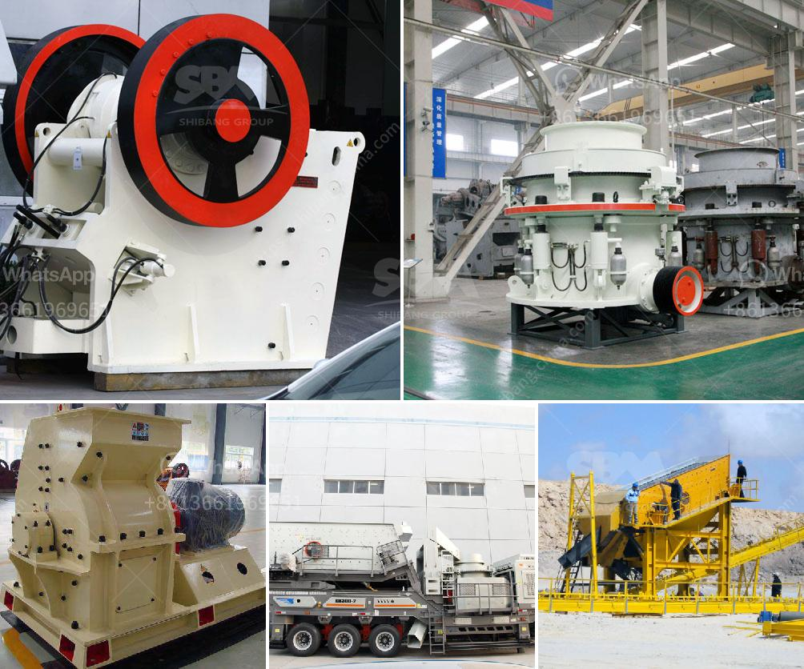

<h3>stone crushing plant project report doc</h3>
The project report for Stone Crushing Plant is a comprehensive document that covers all aspects of the project including the feasibility study, market analysis, cost estimation, revenue forecast, and documentation for obtaining funding. The report includes information about the project background, objectives, scope, implementation schedule, financial aspects, and other relevant details.

A stone crushing plant is a project report for stone crushing plant project report doc that outlines the progress in the construction of the plant, installation, operation, and maintenance of the equipment such as crushers, grinding mills, material handling equipment, etc. it provides a framework for the analysis of the project and also serves as a guide for the implementation of the project.

The project report for stone crushing plant is also known as stone crusher project report, stone quarry crushing plant project report, stone crusher plant project report pdf, and stone crusher monthly report pdf. The crushing plant project report is used for various purposes such as for the preparation of market research reports, feasibility reports, and business plans. For example, if you are planning to invest in a stone crushing plant in a town or city, the first thing you need to consider is the machinery and equipment required for the project. In this case, you will need to provide a detailed report on the estimated cost, machinery required, and financial viability of the project.

The Stone Crushing Plant project is a major project that relies on the business of its operations. However, the acquisition of resources is a major function of the project. The acquisition of resources such as the land and machinery will need sustainable sourcing, and the resources, to be unique, efficient, and cost-effective. Similarly, at every stage of the life cycle of the project, from its establishment to its decommissioning, the acquisition of material resources is inevitable as far as the generation of waste is concerned, therefore, a crushing plant project report becomes an essential document to meet the stakeholder requirements.

One of the most important materials required for any construction is stone chips. It is used along with cement, steel, and bridge in any and all kinds of construction works. Different sizes of stone chips are required for different kinds of construction works, and one can get the stone crushed into various sizes like 12mm, 20mm, 35mm, etc. Nowadays, the crushing plant is in demand because of its lower cost, price, maintenance, and easily availability.

The primary goal of the project report for stone crushing plant is to assess the market demand and opportunity for the product. The document also highlights the potential risks and challenges that are associated with the project. Alongside this, it outlines the necessary steps or actions that are required to mitigate those risks and challenges.

The project report for stone crusher plant is a document that shows the project activities and its repayment schedule. For those who are seeking financial support from the lender, it will be essential to provide a stone crusher plant project report to gain finance from the banks.

In conclusion, a stone crusher plant project report provides a detailed analysis of the market and its various aspects. With the aid of a comprehensive report, it is easier to understand the project's viability and make necessary arrangements for its execution.
<h3>Contact us</h3><ul><li><strong>Whatsapp:&nbsp;<a href="https://wa.me/8613661969651">+8613661969651</a></strong></li><li><a href="https://swt.shibang-china.com/?git&amp;zhl&amp;stone crushing plant project report doc"><strong>Online Service(chat now)</strong></a></li></ul><h3>Related</h3><ul><li><a href='vibrating screens 250tph.md'>vibrating screens 250tph</a></li><li><a href='ballast crushing equipment in kenya.md'>ballast crushing equipment in kenya</a></li><li><a href='cement plant in turkey.md'>cement plant in turkey</a></li><li><a href='gypsum powder making machine pdf.md'>gypsum powder making machine pdf</a></li><li><a href='gravel wash plant for sale.md'>gravel wash plant for sale</a></li></ul>