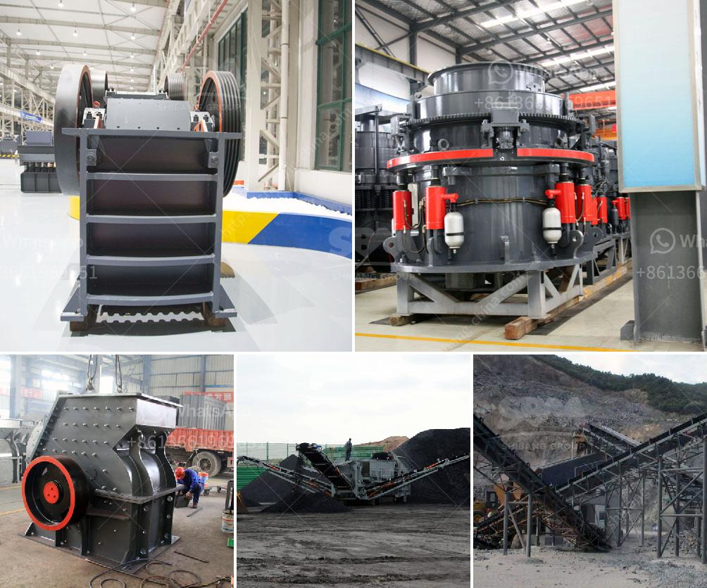

<h3>stone crushing project complete quarry project machine</h3>
Stone crushing can be operated in two ways, either by a complete crushing line or by a stand-alone machine such as crushers, conveyors, and screeners. The crushed stones are used primarily for road construction and maintenance, as well as for cement production. A stone crushing project can be a profitable venture if carefully planned and executed.

The first step in starting a stone crushing project is the selection of a suitable site. It should be far from residential areas and close to the source of raw materials to minimize transportation costs. The site should also have enough space for the installation of machinery and storage of raw materials.

Once the site is selected, the next step is to obtain the necessary permits and licenses from the local authorities. This usually includes an environmental clearance certificate, a mining lease, and a consent to establish from the pollution control board. It is important to comply with all the regulatory requirements to avoid any legal issues in the future.

After obtaining the necessary approvals, the next step is to set up the machinery required for stone crushing. This may include crushers, conveyors, vibrating screens, and different sizes of stones. The type and capacity of the machinery depend on the size of the project and the desired output.

The machinery should be efficient and durable to ensure smooth operations and minimize downtime. It is important to select machines from reputable manufacturers who offer reliable after-sales service and spare parts support. Regular maintenance and servicing of the machinery are crucial to ensure uninterrupted production.

The next step is to procure the raw materials required for stone crushing. This may include stones of different sizes and grades, aggregates, and sand. The quality and availability of raw materials play a crucial role in the success of the project. It is important to establish a reliable and consistent supply chain to avoid delays in production.

Once the machinery and raw materials are set up, the crushing process can commence. The stones are fed into the crushers, which crush them into smaller sizes. The crushed stones are then screened and sorted into different grades and sizes using vibrating screens and conveyors. The final products are stored and transported for further processing or sale.

A well-executed stone crushing project can generate substantial profits. However, there are certain challenges that need to be addressed. These may include fluctuations in raw material prices, competition from other stone crushing companies, and environmental concerns. It is important to stay updated with market trends and continuously adapt to changing conditions.

In conclusion, a stone crushing project can be a profitable venture if carefully planned and executed. It requires careful selection of a suitable site, obtaining necessary permits, setting up efficient machinery, and ensuring a consistent supply of raw materials. By addressing potential challenges and staying updated with market trends, one can succeed in this industry.
<h3>Contact us</h3><ul><li><strong>Whatsapp:&nbsp;<a href="https://wa.me/8613661969651">+8613661969651</a></strong></li><li><a href="https://swt.shibang-china.com/?git&amp;zhl&amp;stone crushing project complete quarry project machine"><strong>Online Service(chat now)</strong></a></li></ul><h3>Related</h3><ul><li><a href='ton per hour gold wash plant.md'>ton per hour gold wash plant</a></li><li><a href='sand dryer machine italy.md'>sand dryer machine italy</a></li><li><a href='stone gravel crusher price at ranchi.md'>stone gravel crusher price at ranchi</a></li><li><a href='material engineering previous objective questions.md'>material engineering previous objective questions</a></li><li><a href='how to build a gold wash plant.md'>how to build a gold wash plant</a></li></ul>