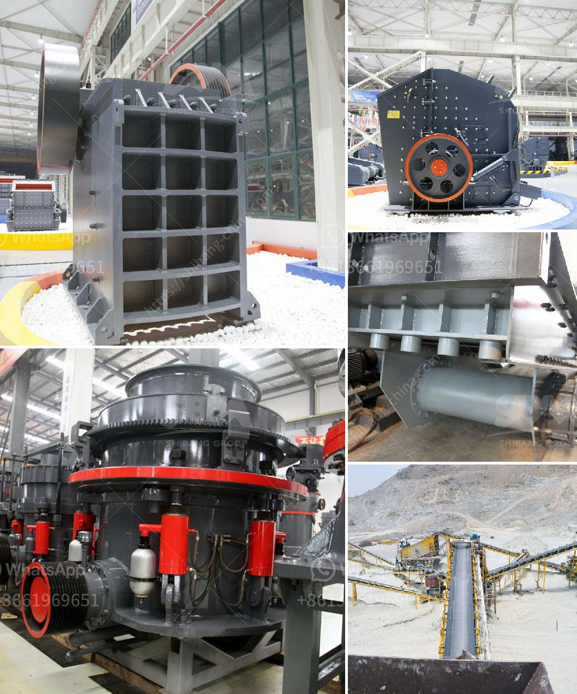

<h3>stone crushing quarry equipment</h3>
Stone crushing quarry equipment is widely used in mining, smelting, building materials, highway, railway, water conservancy and other industries. The quality of the quarry equipment directly affects the final output of the quarrying production line. Therefore, the quarrying process must be strictly controlled.

Quarry equipment refers to the machines that are used in quarrying activities such as drilling, crushing, screening, conveying, etc. They include jaw crushers, cone crushers, impact crushers, vibrating feeders, vibrating screens, belt conveyors, and sand washing machines, among others.

Quarry equipment production line equipment configuration is based primarily on stone specifications, capacity and application of final products. We provide pre-sale, in-sale and after-sale services and strive for the customer to design the most rational and economical crushing plant based on customer production site.

The quarry equipment mainly includes feeding equipment, crushing equipment, screening equipment, sand making equipment, conveying equipment, and material transportation equipment. Among them, crushers are the most critical and essential machines in the quarry crushing plant.

Crusher machine is the key equipment for crushing materials after being crushed, which is widely used in cement, silicate products, new building materials, refractory materials, fertilizers, black and non-ferrous metal beneficiation, and glass ceramics production industries.

The cone crusher has a simple structure, stable operation, easy maintenance, high crushing efficiency, low energy consumption, and uniform product size. It is suitable for crushing various ores and rocks with medium or higher hardness. The hydraulic cone crusher is suitable for crushing hard or medium hardness materials, such as iron ore, copper ore, granite, basalt, etc.

The jaw crusher is the primary crushing equipment for crushing various ores and rocks with compressive strength below 320MPa. It features high crushing ratio, large capacity, easy maintenance, and low operating costs. It is widely used in mining, metallurgy, construction, highway, railway, and water conservancy industries.

In addition to crushers, quarry equipment also includes vibrating feeders, vibrating screens, belt conveyors, and sand washing machines. Vibrating feeders are used to continuously and evenly feed materials into the crushers. Vibrating screens are used to screen and separate materials of different sizes. Belt conveyors transport materials between different locations. Sand washing machines are used to clean and separate impurities in sand and gravel aggregates.

Overall, stone crushing quarry equipment plays a crucial role in the construction industry. As the leading mining machinery manufacturer and exporter, we are dedicated to providing customers with better crushing equipment, grinding equipment, and beneficiation equipment. We will continue to innovate and improve our product quality to meet customer needs and create a better future together.
<h3>Contact us</h3><ul><li><strong>Whatsapp:&nbsp;<a href="https://wa.me/8613661969651">+8613661969651</a></strong></li><li><a href="https://swt.shibang-china.com/?git&amp;zhl&amp;stone crushing quarry equipment"><strong>Online Service(chat now)</strong></a></li></ul><h3>Related</h3><ul><li><a href='mining crusher equipment south africa.md'>mining crusher equipment south africa</a></li><li><a href='sale of crushers in malaysia.md'>sale of crushers in malaysia</a></li><li><a href='how to make a talcum powder.md'>how to make a talcum powder</a></li><li><a href='industrial ball mill.md'>industrial ball mill</a></li><li><a href='used vertical grinding machine.md'>used vertical grinding machine</a></li></ul>