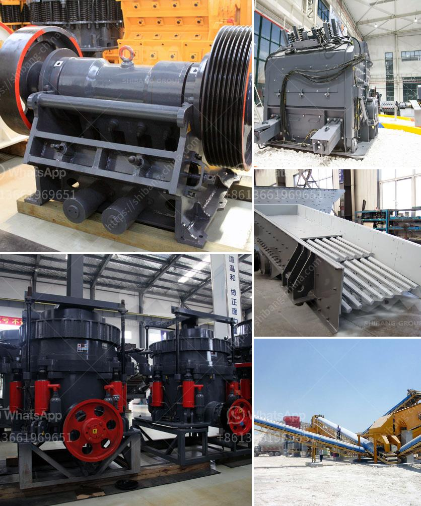

<h3>stone gravel crusher price at ranchi</h3>
Ranchi, the capital city of Jharkhand, is known for its rich cultural heritage and natural beauty. The city is also home to numerous stone gravel crusher plants that contribute to its thriving mining sector. Being one of the prominent industrial centers in the region, Ranchi experiences an increasing number of construction and infrastructure projects, boosting the demand for stone gravel crushers.

Stone gravel crushers are indispensable machineries in the mining and construction industries. These crushers are used for crushing large rocks into smaller gravel pieces that are further used in various construction applications. Whether it is for road construction, building foundations, or landscaping projects, stone gravel crushers play a crucial role.

One of the primary factors affecting the price of stone gravel crushers in Ranchi is the increasing demand. As infrastructure projects rise in number, the need for stone gravel crushers also surges. This leads to a rise in production, resulting in an increase in the price of these machineries. Moreover, the manufacturing cost and raw material availability also contribute to the final price of these crushers.

Additionally, technological advancements in stone gravel crushers also impact their prices. With the development of more efficient and productive crushers, the cost of manufacturing these machines tends to be higher. However, the higher price often translates into improved performance, durability, and energy efficiency. These advanced features make them attractive to customers, despite the higher cost.

Another factor that affects the price of stone gravel crushers is the location of the manufacturer or supplier. Stone gravel crushers are usually heavy machinery, which makes transportation costs an important consideration. If the manufacturer or supplier is located near Ranchi, the transportation cost is relatively lower, resulting in a more competitive price for customers in the area. On the other hand, crushers imported from distant locations might have higher prices due to increased shipping charges.

The quality of stone gravel crushers also determines their price. High-quality crushers not only offer better performance but also require less maintenance, providing long-term cost savings to the buyers. Investing in a reliable crusher ensures smooth operations and reduces the risk of breakdowns, leading to increased productivity and profitability for businesses.

To make an informed decision about purchasing a stone gravel crusher in Ranchi, it is essential to compare prices from different manufacturers and suppliers. Additionally, it is advisable to consider factors such as warranty, after-sales service, and spare parts availability when selecting a crusher. These aspects contribute to the overall cost and long-term benefits of the machinery.

In conclusion, the price of stone gravel crushers in Ranchi is influenced by various factors such as demand, technological advancements, location of manufacturer or supplier, and quality. As the demand for construction and infrastructure projects increases, the need for stone gravel crushers grows, impacting their prices. Despite the cost, investing in high-quality crushers ensures better performance and long-term cost savings. Therefore, thorough research and consideration of these factors are essential when purchasing a stone gravel crusher in Ranchi.
<h3>Contact us</h3><ul><li><strong>Whatsapp:&nbsp;<a href="https://wa.me/8613661969651">+8613661969651</a></strong></li><li><a href="https://swt.shibang-china.com/?git&amp;zhl&amp;stone gravel crusher price at ranchi"><strong>Online Service(chat now)</strong></a></li></ul><h3>Related</h3><ul><li><a href='crusher machine in china.md'>crusher machine in china</a></li><li><a href='italia gypsum block making mechines.md'>italia gypsum block making mechines</a></li><li><a href='portable stone crushers uganda for sale.md'>portable stone crushers uganda for sale</a></li><li><a href='roll crushers for sale.md'>roll crushers for sale</a></li><li><a href='iron ore mobile crusher.md'>iron ore mobile crusher</a></li></ul>