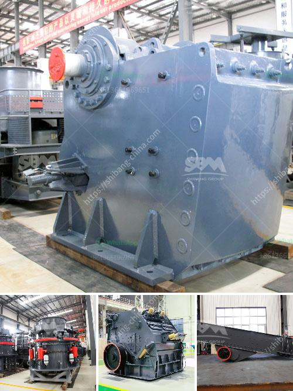

<h3>stone portable crusher</h3>
Portable stone crushers have become a major contributor to the construction industry due to their ease of mobility. This gives contractors the flexibility to deploy them at different locations for different projects. With this in mind, it is critical that contractors know how to select the right portable crusher to suit their needs.

The significance of stone crusher in construction industry cannot be overstated owing to the presence of heavy-duty machinery for crushing. In large mining and quarrying operations, jaw crusher is mainly used for coarse crushing and medium crushing in the departments of mining, building materials and infrastructure construction. According to the feeding width, it can be divided into large, medium and small sized.

Mobile aggregate crushing plant presents itself as a more efficient option to frequent stationary applications. To illustrate the point, portable crusher exporter ABHIJIT DEBNATH says that quarries have adopted various measures such as purchasing durable equipment, and leveraging refurbishment and customization options to reduce downtime and achieve a faster return on investments.

The market size for mobile crushers and screeners is estimated to increase at a CAGR of 7.13% by 2025, from USD 2.14 billion in 2019 to USD 3.01 billion by 2025. The growth in infrastructure development projects such as dams, railway ballast, airports, expressways, and national highways and construction industry in Asia-Pacific and LAMEA regions drives the global market for stone crushers.

One of the key drawbacks of portable stone crushers is their limited ability to produce material at higher levels, compared to stationary crushers. To enhance productivity without increasing costs, some machines have a portable design, making them an excellent choice for reducing downtime on large projects.

With the advancements in portable stone crushers, many manufacturers are giving them various additional features, which opens up new opportunities for large and small contractors alike. One such advancement is the ability to adjust the discharge setting, which can be done with just a few buttons on a handheld remote control. This allows operators to quickly change the size of the material being produced, resulting in higher efficiency and productivity.

Another advantage of portable stone crushers is that they can be used in various applications such as recycling, mining, and quarrying. This versatility allows contractors to use the equipment on different job sites without the need for multiple machines. This not only saves costs but also reduces the environmental impact associated with multiple machines operating simultaneously.

The ease of mobility provided by portable stone crushers also ensures that contractors can quickly move them from one site to another, depending on the project requirements. This flexibility allows contractors to complete projects within the given timeframe, saving time and money.

In conclusion, the increasing demand for stone crushers in the construction industry has boosted the growth of the market for portable stone crushers. The ability to crush any type of material, including concrete, asphalt, and hard rock, efficiently and economically is just one of the many advantages of these machines. With improvements in technology, portability, and versatility, portable stone crushers will continue to play a vital role in the construction industry, providing contractors with the mobility and flexibility they need to succeed.
<h3>Contact us</h3><ul><li><strong>Whatsapp:&nbsp;<a href="https://wa.me/8613661969651">+8613661969651</a></strong></li><li><a href="https://swt.shibang-china.com/?git&amp;zhl&amp;stone portable crusher"><strong>Online Service(chat now)</strong></a></li></ul><h3>Related</h3><ul><li><a href='limestone processing limestone processing plant.md'>limestone processing limestone processing plant</a></li><li><a href='crushing roller mill japan.md'>crushing roller mill japan</a></li><li><a href='crusher plant in nigeria pakistan.md'>crusher plant in nigeria pakistan</a></li><li><a href='ton per hour gold wash plant.md'>ton per hour gold wash plant</a></li><li><a href='crusher for crushed stone 110 price.md'>crusher for crushed stone 110 price</a></li></ul>