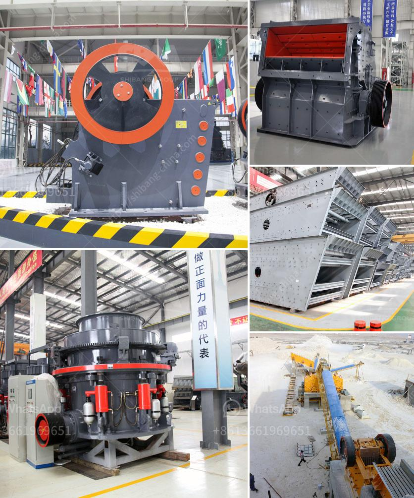

<h3>stone quarry machine price</h3>
Stone quarry machines are used in mines and quarries around the world to crush, grind, and cut different types of stones. These machines are preferred for their durability, flexibility, and availability in different sizes and capacities. However, determining the price of these machines can be a complex task as it depends on several factors. In this article, we will explore some of these factors that influence the pricing of stone quarry machines, helping potential buyers make informed decisions.

There is a wide range of stone quarry machines available in the market, each serving a specific purpose. Common types include jaw crushers, cone crushers, impact crushers, and vertical shaft impact crushers. The prices may vary based on the machine type, with larger and more specialized machines generally commanding higher prices.

Production capacity is another crucial factor that determines the price of a stone quarry machine. Higher-capacity machines are typically more expensive since they can process larger quantities of materials in a shorter time. It is vital to evaluate the required production capacity based on the specific needs of the mine or quarry to make an appropriate investment.

Advancements in technology have led to the development of more technologically advanced quarry machines. These machines often come equipped with additional features such as automation, remote control operation, and advanced safety mechanisms. Such specialized features can significantly impact the price of the machine. Buyers need to assess which features are essential for their specific requirements before deciding on a purchase.

Brand reputation and the overall quality of the stone quarry machine play a crucial role in determining its price. Well-established brands with a proven track record of delivering reliable and durable machines often command higher prices. While these machines might be more expensive upfront, they tend to offer better long-term value due to their superior performance and extended lifespan.

The price of a stone quarry machine also needs to account for transport and delivery costs. Machines need to be transported from the manufacturing facility to the buyer's location, which can involve significant logistical expenses. Additionally, international shipping costs may apply if the machine is purchased from a supplier in a different country. Buyers should consider these costs when evaluating the overall price of the machine.

Market competition also plays a part in determining stone quarry machine prices. In regions where several machine suppliers are present, buyers have more options, which leads to increased market competition. This competition can translate into lower prices as suppliers try to attract potential buyers. It is advisable to research the local market and compare prices from multiple suppliers to ensure a competitive price for the desired machine.

In conclusion, the price of a stone quarry machine is influenced by various factors, including machine type, production capacity, technology, brand reputation, transport costs, and market competition. Buyers should consider these factors alongside their specific needs and budget to make an informed purchasing decision. By doing so, they can acquire a high-quality machine at a reasonable price, ensuring optimal efficiency and productivity in their mining or quarrying operations.
<h3>Contact us</h3><ul><li><strong>Whatsapp:&nbsp;<a href="https://wa.me/8613661969651">+8613661969651</a></strong></li><li><a href="https://swt.shibang-china.com/?git&amp;zhl&amp;stone quarry machine price"><strong>Online Service(chat now)</strong></a></li></ul><h3>Related</h3><ul><li><a href='small scale gold ball mill.md'>small scale gold ball mill</a></li><li><a href='gravel crushers for sale in.md'>gravel crushers for sale in</a></li><li><a href='used track mounted stone crusher.md'>used track mounted stone crusher</a></li><li><a href='buy roller crusher.md'>buy roller crusher</a></li><li><a href='crushers south africa.md'>crushers south africa</a></li></ul>