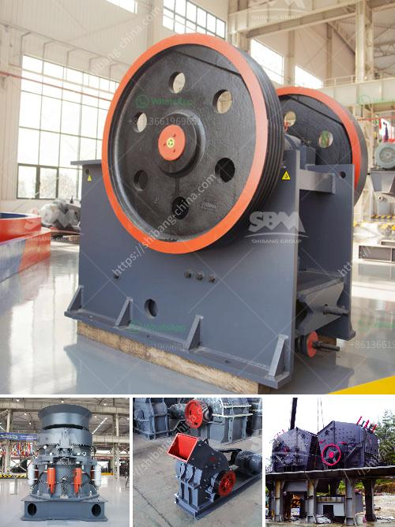

<h3>stone sand making machine</h3>
Stone sand making machine is a powerful machine that combines crushing and shaping together. It is often used for processing stones or rocks in industries such as metallurgy, building materials, mining, cement and chemical engineering.

The stone sand making machine is equipped with advanced "stone-rock crushing principle", which ensures the good crushing effect of the machine. According to the needs of customers, the stone sand making machine is equipped with different crushing equipment. Different types of crushing chambers can be equipped according to the crushing requirements of stones, so as to improve the utilization rate of materials and reduce the wear of wear-resistant parts.

The stone sand making machine has a variety of functions such as fine crushing and coarse grinding. It has a unique "stone-rock friction crushing" method, which can effectively improve the crushing efficiency and reduce the wear of wear-resistant parts. The stone sand making machine uses the principle of "stone-rock collision crushing" to crush stones, which can further improve the crushing efficiency and reduce the wear of wear-resistant parts.

The stone sand making machine is equipped with a hydraulic device, which can quickly adjust the discharge port and easily clear the cavity. The crushing cavity of the machine adopts a symmetrical "V-shaped" structure, which ensures uniform particle size and good particle shape. The stone sand making machine has a simple and reasonable structure, which makes the operation and maintenance of the machine more convenient.

The stone sand making machine is equipped with an automatic lubrication system, which can automatically lubricate the bearing parts of the machine, reduce the wear of the bearing parts, and prolong the service life of the machine. The stone sand making machine has a high degree of automation, which can reduce labor costs and improve production efficiency.

The stone sand making machine has a wide range of applications. It can crush and shape various hard and brittle materials such as limestone, granite, river pebble, basalt, iron ore, copper ore, etc. The crushed stones can be used as raw materials for construction, road construction, cement production, etc. The stone sand making machine has been widely used in various fields, and has received high praise from customers.

In conclusion, the stone sand making machine is a powerful machine that combines crushing and shaping. It has the advantages of high crushing efficiency, good particle size, simple structure, easy maintenance and wide application. With the continuous development of technology, the stone sand making machine will play a more important role in various industries and contribute to the development of the industry.
<h3>Contact us</h3><ul><li><strong>Whatsapp:&nbsp;<a href="https://wa.me/8613661969651">+8613661969651</a></strong></li><li><a href="https://swt.shibang-china.com/?git&amp;zhl&amp;stone sand making machine"><strong>Online Service(chat now)</strong></a></li></ul><h3>Related</h3><ul><li><a href='24 x 15 jaw crusher zenith.md'>24 x 15 jaw crusher zenith</a></li><li><a href='basalt crushing machine.md'>basalt crushing machine</a></li><li><a href='conventional hammer mill.md'>conventional hammer mill</a></li><li><a href='ore beneficiation plant.md'>ore beneficiation plant</a></li><li><a href='track crushing plant.md'>track crushing plant</a></li></ul>