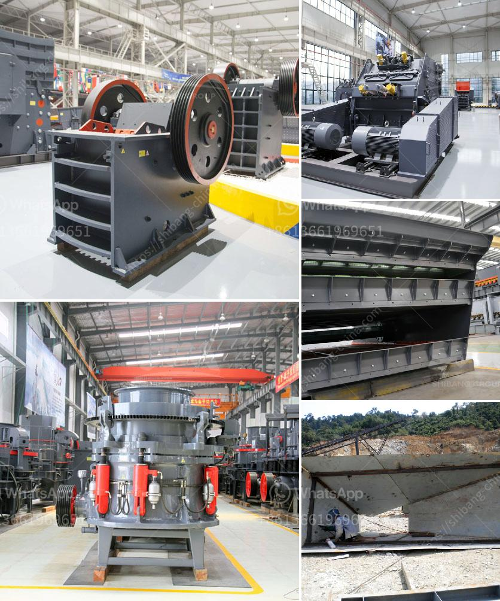

<h3>stoner cusher price in kenya</h3>
In recent years, Kenya has seen a growing demand for building materials as the population continues to increase. This has led to a surge in construction projects, both in urban and rural areas, creating a need for high-quality building materials, including stones. Stoner crushers, also known as stone crushers, are machines designed to break larger rocks into smaller pieces. They are commonly used in the construction industry to produce gravel, sand, and other building materials.

One of the main factors that influence the price of stoner crushers in Kenya is their size. Crushers can vary significantly in terms of their output capacity, ranging from small units suitable for both individual use and small-scale construction projects to larger, industrial-grade crushers used in large construction sites. Generally, the larger the crusher's output capacity, the higher its price.

Another key factor affecting stoner crusher prices is the type of engine used to power the machine. In Kenya, stoner crushers are commonly powered by diesel engines. While diesel engines are generally more expensive upfront, they offer several advantages in terms of durability, fuel efficiency, and ease of maintenance compared to gasoline or electric-powered crushers. Consequently, diesel-powered crushers tend to be more expensive than their counterparts.

The brand and reputation of the stoner crusher manufacturer also play a significant role in determining the price. Established brands with a proven track record of producing high-quality and reliable machines often charge a premium for their products. On the other hand, lesser-known brands or those with a less established reputation may offer lower-priced options. However, it is crucial to consider the trade-off between price and quality, as a cheaper machine may not have the same level of performance, durability, and after-sale support as a well-known brand.

Furthermore, the cost of transporting the stoner crusher to the construction site can also add to its overall price. In Kenya, transportation costs can be especially significant, particularly for crushers sourced from other regions or countries. Therefore, buyers should consider the logistics involved and whether the added expenses are justifiable in relation to the overall project cost.

It is worth noting that the price of stoner crushers in Kenya can vary from supplier to supplier. Due to the competitive nature of the market, different suppliers may offer different price ranges and promotional deals to attract customers. It is advisable for buyers to research and compare prices from multiple suppliers to ensure they get the best value for their money.

In conclusion, the price of stoner crushers in Kenya is influenced by various factors, including the size, type of engine, brand reputation, and transportation costs. It is essential for buyers to carefully evaluate these factors and conduct thorough research to make an informed purchasing decision. Investing in a high-quality stoner crusher may involve a higher upfront cost but can lead to long-term savings and improved construction efficiency.
<h3>Contact us</h3><ul><li><strong>Whatsapp:&nbsp;<a href="https://wa.me/8613661969651">+8613661969651</a></strong></li><li><a href="https://swt.shibang-china.com/?git&amp;zhl&amp;stoner cusher price in kenya"><strong>Online Service(chat now)</strong></a></li></ul><h3>Related</h3><ul><li><a href='granite stone crusher india.md'>granite stone crusher india</a></li><li><a href='cone crusher in mexico.md'>cone crusher in mexico</a></li><li><a href='coal mill reject conveying system.md'>coal mill reject conveying system</a></li><li><a href='quarry causer machine.md'>quarry causer machine</a></li><li><a href='aggregate processing equipment.md'>aggregate processing equipment</a></li></ul>