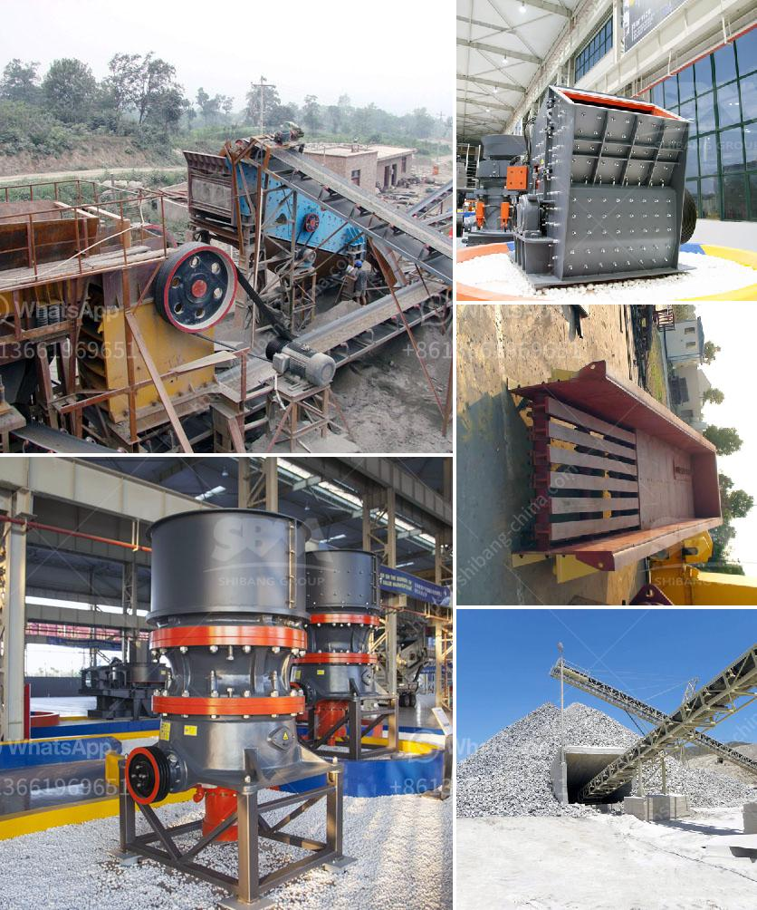

<h3>supplier stone crusher indonesia</h3>
Indonesia is one of the biggest and most populous countries in the world, and it is known for its rich natural resources, such as coal, oil, and gas. There is also a significant supplier of stone crushers in Indonesia.

The stone crusher industry in Indonesia is growing rapidly due to the increasing demand for construction materials, such as aggregates, slags, and road bases. The supplier of stone crushers such as Shanbao, Metso, Sandvik, Fote, etc. are prominent players in the market. The robust growth of the construction industry in Indonesia is expected to create a significant market for stone crushers. Various types of stone crushers are used within the mining industry. Actually, different types of mines require a number of crushers.

In the past, mines and industries were ruled by traditional technology and all work was done manually. But as time went on, technology advanced, and the use of heavy machinery became more common. Today, stone crushers are widely used for multiple applications in industries, such as mining, construction, metallurgy, and many others.

Stone crushing involves the use of machines to break down large stones into smaller pieces. These machines come in different sizes and types, such as crushers, mills, and recyclers. Most crushers can be used for crushing a variety of stones, such as limestone, basalt, granite, dolomite, phosphate rock, and many others. Furthermore, they are capable of crushing large pieces of stone into small sizes, reducing the overall time and effort required for the process.

The availability of a wide variety of stone crushers in the market makes it easy for buyers to choose the most suitable and efficient one. Buyers can choose from different sizes, styles, and capacities, depending on their specific needs and requirements. Additionally, stone crushers come with different features, such as high crushing ratio, adjustable discharge size, and easy maintenance.

When purchasing a stone crusher from a supplier in Indonesia, it is important to consider several factors, such as the machine's capacity, power consumption, reliability, and lifespan. Additionally, buyers should also consider the type of stone they wish to crush, as different types of stones require different machinery.

In conclusion, the stone crusher industry in Indonesia is growing rapidly due to the increasing demand for construction materials. The availability of a wide variety of stone crushers in the market makes it easy for buyers to choose the most suitable and efficient one. The suppliers of stone crushers such as Shanbao, Metso, Sandvik, Fote, etc. are prominent players in the market who have manufactured quality stone crushers for decades. As technology advances, the use of heavy machinery is becoming more common in the stone crusher industry, leading to a more efficient and effective crushing process.
<h3>Contact us</h3><ul><li><strong>Whatsapp:&nbsp;<a href="https://wa.me/8613661969651">+8613661969651</a></strong></li><li><a href="https://swt.shibang-china.com/?git&amp;zhl&amp;supplier stone crusher indonesia"><strong>Online Service(chat now)</strong></a></li></ul><h3>Related</h3><ul><li><a href='calcite grinding plant.md'>calcite grinding plant</a></li><li><a href='rock and gravel crushers used.md'>rock and gravel crushers used</a></li><li><a href='stone crusher kapasitas 150m.md'>stone crusher kapasitas 150m</a></li><li><a href='mobile crushers in mining.md'>mobile crushers in mining</a></li><li><a href='high capacity stone hammer crusher.md'>high capacity stone hammer crusher</a></li></ul>