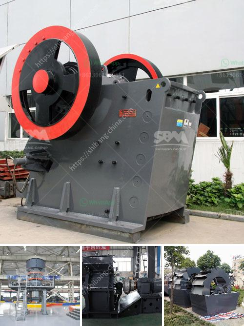

<h3>suppliers of chrome ore beneficiation plant</h3>
Chrome Ore Beneficiation Plant (COBP) & Chrome Ore Grinding (COGP) are two processes to mine and grind the ores to produce beneficiated chrome concentrate. At present, Google Chrome has become the dominant browser across the globe, owing to its simplicity, ease of use, and fast operation. Similarly, South Africa is the world's largest source of chrome ore production and the leading exporter of chrome ore. South African chrome ore suppliers are currently well-positioned to cater to the growing global demand for chrome products, offering competitive prices and a steady supply of quality chrome ore.

The chrome ore beneficiation plant consists of a series of consecutive unit operations, ranging from screening and classification, crushing, grinding, gravity separation, magnetic separation, flotation, dewatering, and drying. Chrome ore is beneficiated according to various physico-chemical properties, and the process aims to remove impurities and enhance the concentration of chrome.

Suppliers of chrome ore beneficiation plant exert an ongoing effort to provide high-quality, reliable, and innovative services to meet market demands and customers' needs. These suppliers endeavor to make use of the latest technologies and equipment to upgrade chrome ore and enhance its value as a key ingredient in the production of various stainless steel and high-alloy materials.

One prominent South African supplier of chrome ore beneficiation plant is Johron Processing (Pty) Ltd., which serves as an outsourced Production Outsourced Plant (POP) for several mines in the area. Johron Processing offers a one-stop service for the entire value chain, from crushing and screening to washing and sorting. With their advanced processing techniques and state-of-the-art equipment, they are able to produce high-quality chrome concentrate with low impurities.

Another notable supplier of chrome ore beneficiation plant is Hengcheng Mining Equipment Co., Ltd., which specializes in the production of mining equipment, including mineral processing equipment and sand production line equipment. With more than 20 years of experience in this field, Hengcheng Mining Equipment Co., Ltd. has successfully served numerous chrome ore beneficiation plants worldwide.

The suppliers of chrome ore beneficiation plant play a critical role in unlocking the vast potential of South Africa's chrome resources. By actively collabora+ting with miners and investing in the latest technologies, they are able to process chrome ore more efficiently and produce a final product that meets the highest quality standards. This, in turn, enables downstream industries to produce high-quality stainless steel and other chrome-related products.

Moreover, suppliers of chrome ore beneficiation plant contribute to job creation and economic growth in South Africa. The chrome mining industry is labor-intensive, benefiting local communities and supporting small and medium-sized enterprises. In addition, the beneficiation process requires skilled professionals, creating employment opportunities for engineers, geologists, metallurgists, and other professionals in the mining sector.

Suppliers of chrome ore beneficiation plants in South Africa are essential players in the mining industry, contributing significantly to the country's economy. With their expertise and technological advancements, they are able to produce high-quality chrome concentrate that caters to the growing global demand for chrome products. By supporting the chrome mining industry, these suppliers create job opportunities and drive economic growth while ensuring sustainable development in South Africa.
<h3>Contact us</h3><ul><li><strong>Whatsapp:&nbsp;<a href="https://wa.me/8613661969651">+8613661969651</a></strong></li><li><a href="https://swt.shibang-china.com/?git&amp;zhl&amp;suppliers of chrome ore beneficiation plant"><strong>Online Service(chat now)</strong></a></li></ul><h3>Related</h3><ul><li><a href='sand washer for price.md'>sand washer for price</a></li><li><a href='grinding plant supplier.md'>grinding plant supplier</a></li><li><a href='rotary kiln untuk pengeringan batu kapur kapur.md'>rotary kiln untuk pengeringan batu kapur kapur</a></li><li><a href='dolomite roller mill.md'>dolomite roller mill</a></li><li><a href='coal washing plant for sale grinding mill china.md'>coal washing plant for sale grinding mill china</a></li></ul>