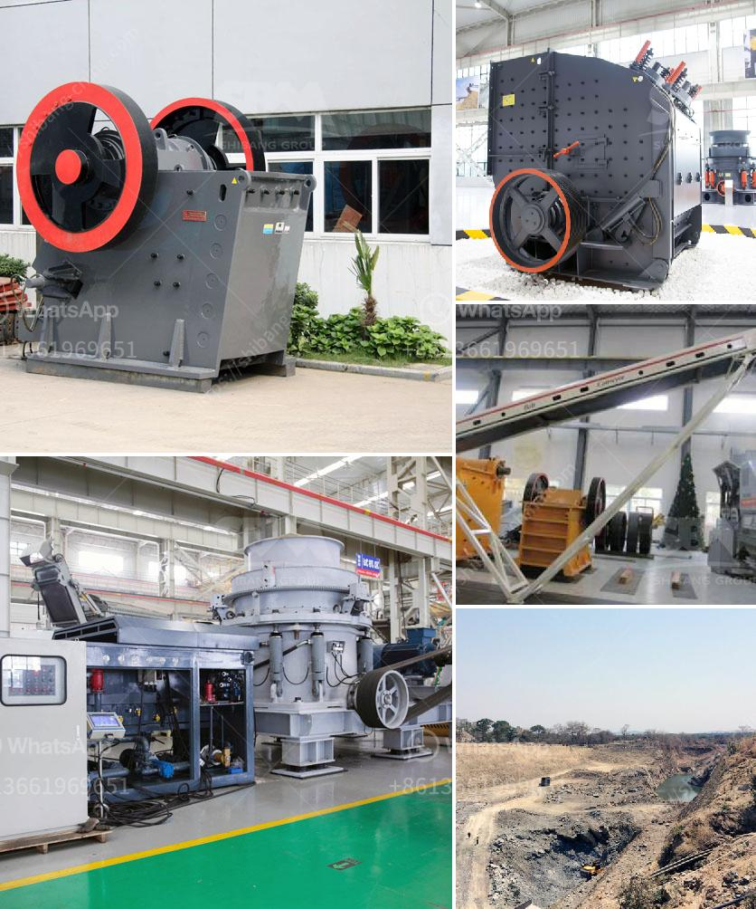

<h3>talc production line</h3>
Talc is a versatile mineral used in various industries, from medicine to cosmetics, ceramics, and even food processing. Its natural properties and abundance make it a valuable material for manufacturing a wide range of products. In this article, we will explore the process of talc production, from mining to milling, shedding light on how this useful mineral goes from raw material to finished product.

The first step in talc production is mining. Talc-bearing rocks are extracted from underground or open-pit mines. These rocks are then crushed and ground into a fine powder using various techniques, including blasting, drilling, and crushing machinery. The extracted talc undergoes rigorous testing to ensure its purity and quality.

Once the talc has been extracted and processed, it is transported to the milling facility. At the milling facility, the talc is further processed to enhance its characteristics and remove impurities. The milling process involves grinding the talc into a fine powder, which can then be used in a variety of applications. Advanced milling machinery, such as ball mills, jet mills, or roller mills, can achieve the desired particle size and distribution, ensuring consistent quality.

During the milling process, certain additives may be incorporated to modify the properties of the talc powder. For example, titanium dioxide may be added to enhance whiteness, while magnesium oxide can improve opacity. These additives are carefully selected and blended, taking into account the specific requirements of the end product.

Once the talc has been milled to the desired fineness, it is then packaged and distributed to various industries. Talc is commonly used in the cosmetics industry, where it is a key ingredient in products such as face powders, blushes, and eyeshadows. Its excellent oil absorption and smooth texture make it ideal for these applications. Talc is also used in pharmaceuticals and nutraceuticals, where it serves as an excipient in tablets and capsules, providing binding and lubrication properties. In ceramics, talc is used to enhance the firing characteristics of clay bodies, reducing shrinkage and improving thermal shock resistance.

The production of talc powder involves stringent quality control measures to ensure consistency and purity. Quality control tests are conducted at various stages of the production process to assess parameters such as particle size, density, moisture content, brightness, and chemical composition. This ensures that the talc powder meets the specific requirements of each industry and application.

In conclusion, the talc production line is a multi-step process that transforms the raw talc rocks into a fine powder suitable for various industries. From mining to milling, each step is carefully carried out to ensure the highest quality and consistency. The versatility of talc as a mineral allows it to be used in a wide range of products, making it a valuable resource in numerous industries around the world.
<h3>Contact us</h3><ul><li><strong>Whatsapp:&nbsp;<a href="https://wa.me/8613661969651">+8613661969651</a></strong></li><li><a href="https://swt.shibang-china.com/?git&amp;zhl&amp;talc production line"><strong>Online Service(chat now)</strong></a></li></ul><h3>Related</h3><ul><li><a href='conveyor belt manufacturers bangladesh.md'>conveyor belt manufacturers bangladesh</a></li><li><a href='machine de lavage a lattrition du sable de silice.md'>machine de lavage a lattrition du sable de silice</a></li><li><a href='how to find startup funding for a stone crushing business.md'>how to find startup funding for a stone crushing business</a></li><li><a href='density of crushed hornfels basalt granite.md'>density of crushed hornfels basalt granite</a></li><li><a href='impact crusher manufacturers in germany.md'>impact crusher manufacturers in germany</a></li></ul>