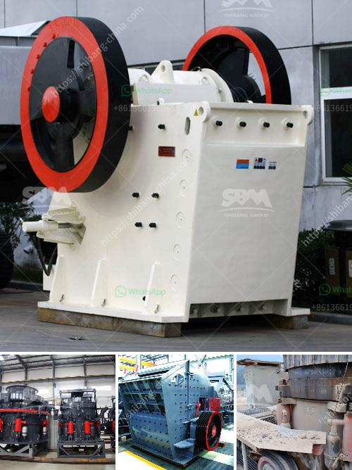

<h3>talcum powder making formulation</h3>
Talcum powder is a widely used household product that is known for its ability to absorb moisture and reduce friction. It is primarily composed of the mineral talc, which is one of the softest minerals in the world. The smooth and silky texture of talcum powder has made it a popular choice for various applications, including personal hygiene, cosmetics, and even industrial uses.

Although talcum powder has been used for decades, its safety and potential health risks have become a topic of concern in recent years. Studies have suggested a potential link between the use of talcum powder in the genital area and an increased risk of ovarian cancer in women. This has led to numerous lawsuits against talcum powder manufacturers, raising questions about the formulation of this product.

The formulation of talcum powder involves a careful balance of ingredients to achieve the desired properties. Talc, which is the main ingredient, is finely ground to create a smooth and powdery texture. To prevent the powder from clumping or caking, anti-caking agents such as magnesium carbonate or silica are added. These agents help maintain the texture and avoid any unwanted moisture absorption.

Fragrances and scents are often added to enhance the user experience and provide a pleasant scent. However, it is important to note that some fragrances may cause irritation or allergic reactions in individuals with sensitive skin. Therefore, it is crucial for manufacturers to consider the potential risks associated with these additives and conduct thorough testing to ensure product safety.

Some talcum powder formulations also include additional ingredients, such as cornstarch or rice flour. These substances may be included to provide additional absorbency or improve the overall texture of the powder. However, it is important to note that cornstarch may be a potential breeding ground for bacteria if it comes into contact with moisture, which could lead to skin infections or irritation.

Manufacturers need to adhere to strict quality control measures to ensure the safety and effectiveness of talcum powder products. This includes rigorous testing of raw materials, monitoring the manufacturing process, and conducting thorough inspections of finished products. By following these protocols, manufacturers can detect any potential contaminants or impurities that may compromise the safety of their products.

In recent years, there has been a growing demand for talcum powder alternatives, especially those that are marketed as talc-free or made from natural ingredients. These alternatives often utilize ingredients such as arrowroot powder, tapioca starch, or even powdered vegetable roots. However, it is important to note that even these alternatives may have their own set of potential risks and limitations, and their safety should also be thoroughly evaluated.

In conclusion, the formulation of talcum powder involves a delicate balance of ingredients to achieve the desired texture, absorption, and safety. Manufacturers need to consider the potential health risks associated with certain ingredients and conduct proper testing to ensure product safety. As consumer awareness increases and alternative products become more readily available, it is crucial for manufacturers to prioritize safety and transparency in their formulations to maintain consumer trust.
<h3>Contact us</h3><ul><li><strong>Whatsapp:&nbsp;<a href="https://wa.me/8613661969651">+8613661969651</a></strong></li><li><a href="https://swt.shibang-china.com/?git&amp;zhl&amp;talcum powder making formulation"><strong>Online Service(chat now)</strong></a></li></ul><h3>Related</h3><ul><li><a href='technical specification belt conveyors.md'>technical specification belt conveyors</a></li><li><a href='crushers mobile crushers american mobile.md'>crushers mobile crushers american mobile</a></li><li><a href='rock quarry crusher machinery.md'>rock quarry crusher machinery</a></li><li><a href='process of cement production.md'>process of cement production</a></li><li><a href='crushers for granite aggregate.md'>crushers for granite aggregate</a></li></ul>