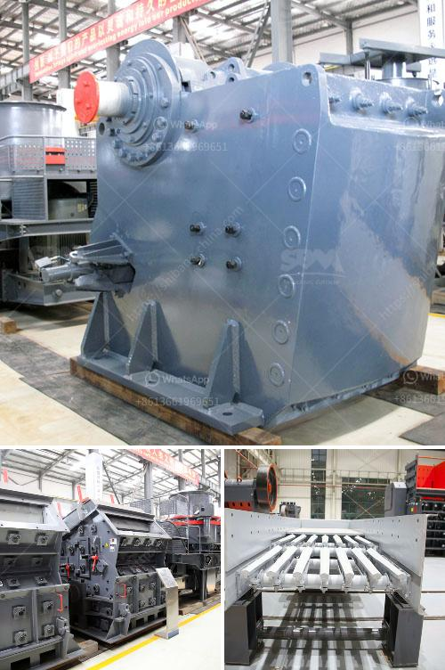

<h3>technical specification belt conveyors</h3>
Belt conveyors are widely used in various industries for the efficient transportation of goods and materials. These mechanical systems consist of a continuous loop of belts, typically made of rubber or fabric, that are powered by pulleys and driven by motors. Belt conveyors offer a reliable and cost-effective method of moving items from one location to another, enhancing productivity and streamlining operations.

When it comes to selecting the right belt conveyor for your specific application, it is crucial to consider the technical specifications that will best meet your needs. These specifications include the belt width, speed, material, and capacity.

Firstly, the belt width determines the maximum size of the material that can be transported. It is essential to choose a belt width that provides enough space for the items to move smoothly without causing any jams or obstructions.

The speed of the belt conveyor is another critical factor. It should be selected based on the type of material being transported and the desired production rate. A higher speed conveyor allows for faster throughput but may require more energy and necessitate additional safety precautions.

The material of the belt is crucial for its durability and performance. Rubber belts are commonly used for general-purpose applications, while fabric belts are suitable for bulk materials handling. In industries where there is a risk of fire, fire-resistant belts should be considered.

Capacity refers to the maximum weight or load that the conveyor can handle. It is important to choose a conveyor with the right capacity to ensure efficient and safe operation. Overloading a conveyor can lead to belt damage, motor failure, and production delays.

In conclusion, when choosing a belt conveyor, considering its technical specifications is crucial to ensure optimal performance and efficiency. Assessing factors such as belt width, speed, material, and capacity will help you select the right conveyor for your needs, enhancing productivity and reducing downtime.
<h3>Contact us</h3><ul><li><strong>Whatsapp:&nbsp;<a href="https://wa.me/8613661969651">+8613661969651</a></strong></li><li><a href="https://swt.shibang-china.com/?git&amp;zhl&amp;technical specification belt conveyors"><strong>Online Service(chat now)</strong></a></li></ul><h3>Related</h3><ul><li><a href='vertical ball mill nigeria.md'>vertical ball mill nigeria</a></li><li><a href='suppliers of chrome ore beneficiation plant.md'>suppliers of chrome ore beneficiation plant</a></li><li><a href='demand of stage concassage mobile.md'>demand of stage concassage mobile</a></li><li><a href='portable stone crushers uganda for sale.md'>portable stone crushers uganda for sale</a></li><li><a href='calcium carbonate grinding.md'>calcium carbonate grinding</a></li></ul>