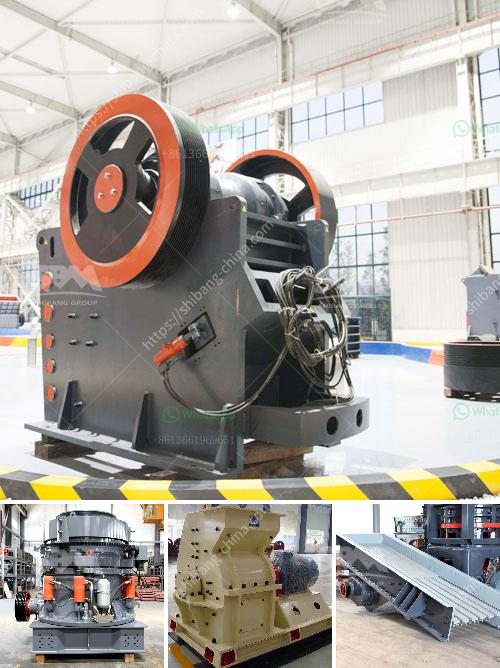

<h3>techniques chips of metal conveyor belts</h3>
Metal conveyor belts are widely used in various industries for material transportation. These belts are made up of interlinked metal chips or discs that provide strength, durability, and versatility. The techniques used to assemble these metal chips are crucial in ensuring efficient and reliable performance of the conveyor belts.

One common technique used in fabricating metal conveyor belts is the spiral coil method. In this technique, a continuous spiral coil of metal chips is created by joining individual chips together. The chips are typically interlocked using specialized tools or manual labor. The spiral coil technique allows for the creation of belts with a continuous and smooth surface, ensuring seamless material transfer.

Another technique commonly used is the hinge joint method. In this method, each chip is individually hinged to its adjacent chips, creating a flexible and articulated structure. The hinge joint technique offers enhanced flexibility and adaptability to the conveyor belt. It allows the belt to conform to curved or irregular pathways, improving its maneuverability and suitability for various applications.

The welding technique is another widely used method for connecting metal chips in conveyor belts. Welding is often preferred for its strength and durability. It involves the use of high-temperature heat sources, such as lasers or electric arcs, to melt and fuse the metal chips together. Welded conveyor belts offer excellent load-bearing capacity and can withstand heavy materials and harsh environments.

Additionally, the clinched method is often employed to connect metal chips in conveyor belts. This technique involves mechanically clinching or fastening the chips together using specially designed tools or machines. The clinched technique provides a secure and reliable connection, ensuring that the metal chips do not come apart during operation. It is particularly suitable for applications requiring high tensile strength and load capacity.

Furthermore, some advanced techniques, such as wire mesh weaving and interlocking, are used to manufacture metal conveyor belts. These techniques involve intricate weaving or interlocking of metal wires to create a mesh structure. Wire mesh belts provide exceptional airflow, making them suitable for applications requiring controlled temperature or ventilation. They are commonly used in food processing, baking, and drying industries.

In conclusion, the techniques used to fabricate metal conveyor belts play a crucial role in their performance and application compatibility. Whether it is the spiral coil, hinge joint, welding, clinching, or wire mesh weaving, each technique offers specific advantages and features. Manufacturers carefully select the most suitable technique based on the requirements of the application, taking into consideration factors such as load capacity, flexibility, temperature resistance, and material compatibility. Continuous research and development in conveyor belt fabrication techniques ensure that these belts keep meeting the demands of modern industries and deliver efficient and reliable material handling solutions.
<h3>Contact us</h3><ul><li><strong>Whatsapp:&nbsp;<a href="https://wa.me/8613661969651">+8613661969651</a></strong></li><li><a href="https://swt.shibang-china.com/?git&amp;zhl&amp;techniques chips of metal conveyor belts"><strong>Online Service(chat now)</strong></a></li></ul><h3>Related</h3><ul><li><a href='crusher supplier saudi.md'>crusher supplier saudi</a></li><li><a href='blands of quarry crusher plant ball mill.md'>blands of quarry crusher plant ball mill</a></li><li><a href='small stone crushers.md'>small stone crushers</a></li><li><a href='chromium ore mining equipmentr.md'>chromium ore mining equipmentr</a></li><li><a href='crushing and screening rustenburg.md'>crushing and screening rustenburg</a></li></ul>