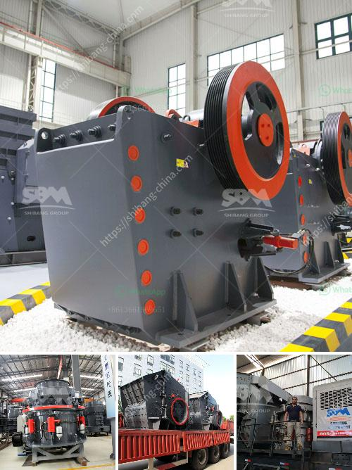

<h3>the cost of chrome washing plants in south africa</h3>
Chrome washing plants are strategic investments for mining companies in South Africa, as they enable the recovery and processing of valuable chrome ore from large deposits. However, these plants come with their own set of costs that need careful consideration. In this article, we explore the various factors that contribute to the costs of chrome washing plants in South Africa.

Setting up a chrome washing plant involves significant infrastructure costs. The plant requires an area large enough to accommodate the processing facilities, including the equipment for crushing, screening, and washing the chrome ore. Additionally, access to a steady water supply and electricity is crucial. The cost of acquiring land and building or renting the necessary infrastructure can vary widely based on location, local agricultural or zoning restrictions, and property market conditions.

The key components of a chrome washing plant are the crushing, screening, and washing equipment. These machines vary in capacity, efficiency, and technological advancements, resulting in a wide range of costs. Larger plants with more sophisticated equipment will generally require a larger initial investment. Regular maintenance and repairs also contribute to the operating costs of the plant.

Operating a chrome washing plant requires a skilled workforce for the day-to-day operations and maintenance. Labor costs can vary depending on location, skills required, labor laws, and costs associated with employee benefits. Additionally, chrome washing plants must adhere to environmental regulations regarding water and air pollution. Compliance with these regulations often requires additional investments in waste treatment systems or emission control technology, thereby increasing the overall costs of operating the plant.

In South Africa, the locations of chrome ore deposits are spread across vast distances. Consequently, transportation costs to bring the mined ore to the washing plants can be substantial. Costs may include vehicle maintenance, fuel, and labor for loading and unloading. Furthermore, transportation costs continue to be a factor during the distribution of the processed chrome to customers or export markets.

The costs associated with chrome washing plants in South Africa are multi-faceted. Infrastructure, equipment, labor, and compliance with regulations are all contributing factors. Understanding these costs is vital for mining companies to make informed investment decisions and maintain a sustainable business model in the chrome mining industry.
<h3>Contact us</h3><ul><li><strong>Whatsapp:&nbsp;<a href="https://wa.me/8613661969651">+8613661969651</a></strong></li><li><a href="https://swt.shibang-china.com/?git&amp;zhl&amp;the cost of chrome washing plants in south africa"><strong>Online Service(chat now)</strong></a></li></ul><h3>Related</h3><ul><li><a href='lime stone crusher plant.md'>lime stone crusher plant</a></li><li><a href='200 mesh ore grinder cost.md'>200 mesh ore grinder cost</a></li><li><a href='coal mining equipment for sale.md'>coal mining equipment for sale</a></li><li><a href='coal mill manufacturer china.md'>coal mill manufacturer china</a></li><li><a href='mobile gold processing plant with price.md'>mobile gold processing plant with price</a></li></ul>